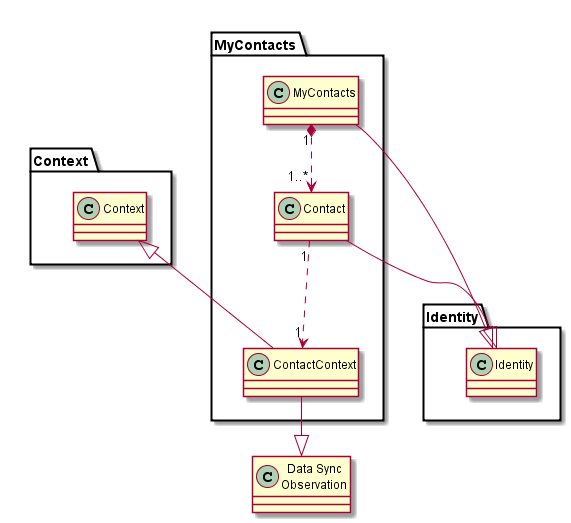
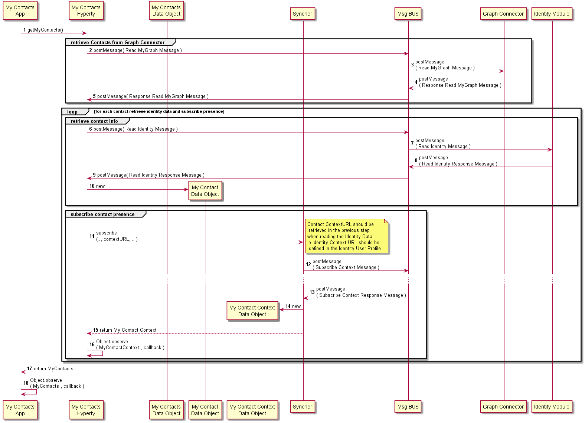
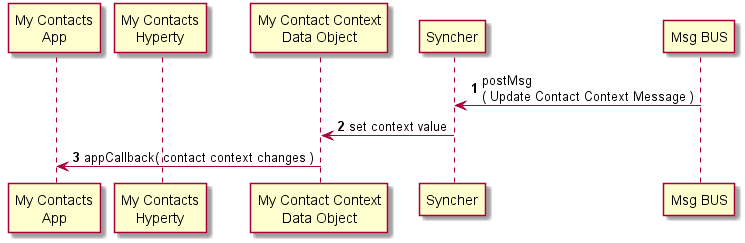

Dummy Header for Section per ToC
================================

Hyperties Specification
=======================

My Contacts Hyperty
-------------------

### Architecture

*Describe main Hyperty functionalities, Hyperty type and scenarios where the Hyperty will be used. Describe main internal Hyperty component architecture with a class diagram.*

The My Contacts Hyperty main functionality is to manage a personal contact list enriched with contextual information including presence status.

### Hyperty Data Objects schemas

*Identify reTHINK standardised data object schemas or Specify new Data Object schemas handled by the Hyperty*

My Contacts data model includes a list of Contact data objects that are compliant with [Identity Data Model](https://github.com/reTHINK-project/architecture/blob/master/docs/datamodel/user-identity/readme.md). Each Contact object is associate with a Contact Context object that is compliant with [Context Data Model](https://github.com/reTHINK-project/architecture/blob/master/docs/datamodel/context/readme.md) which is Observed by the MyContacts Hyperty. Optionaly, the MyContacts object is itself compliant with a (group) Identity data model.



### Hyperty API

*Specify Hyperty API to be consumed by the Application*

**getMyContacts**

```
Promise<MyContacts> getMyContacts( )
```

**addContact**

```
addContact( URL.guidURL guid )
```

**removeContact**

```
removeContact( URL.guidURL guid )
```

### Main data flows

*Use MSCs to describe how the Application can use the Hyperty API for the main use cases supported by the Hyperty. Mapping between the Hyperty API functions and the Hyperty Framework functions including the Data Object handling should be depicted in separated in Diagrams*

*question: should we skip the context production and let it be produced by a separated myContext hyperty that consumes context from different sources including presence status, calendar, bracelet, etc?*

My Contacts Setup:



Receive updates about My Contact Context Updates:


