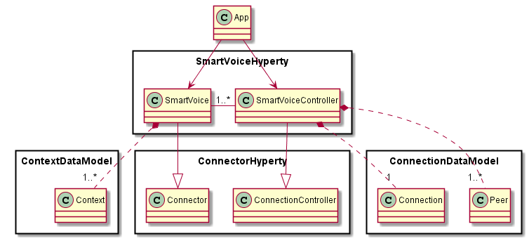

Dummy Header for Section per ToC
================================

Hyperties Specification
=======================

Smart Voice Hyperty
-------------------

### Architecture

*Describe main Hyperty functionalities, Hyperty type and scenarios where the Hyperty will be used. Describe main internal Hyperty component architecture with a class diagram.*

The Smart Voice main functionality is to handle two party audio and voice conversations according to user context. *the support of Multiparty calls is for further study*

As depicted above, the Smart Voice Hyperty is an extension of the [Connector Hyperty](https://github.com/reTHINK-project/scenario-service-implementation/blob/master/docs/hyperties/connector/readme.md) that also is a consumer of standard User [Context Data Objects](https://github.com/reTHINK-project/architecture/tree/master/docs/datamodel/context).

### Hyperty Data Objects schemas

*Identify reTHINK standardised data object schemas or Specify new Data Object schemas handled by the Hyperty*

As an extension of the [Connector Hyperty](https://github.com/reTHINK-project/scenario-service-implementation/blob/master/docs/hyperties/connector/readme.md) the Smart Voice Hyperty handles standard [Connection Data Objects](https://github.com/reTHINK-project/architecture/tree/master/docs/datamodel/connection). In addition it also consumes standard User [Context Data Objects](https://github.com/reTHINK-project/architecture/tree/master/docs/datamodel/context).

### Hyperty API

*Specify Hyperty API to be consumed by the Application*

The Connector Hyperty implements two Hyperty APIs:

#### Hyperty SmartVoice API

In addition to the functions provided by the extended Connector API, the following functions are provided:

*to be provided*

#### Hyperty SmartVoiceController API

In addition to the functions provided by the extended Connector API, the following functions are provided:

*to be provided*

### Main data flows

*Use MSCs to describe how the Application can use the Hyperty API for the main use cases supported by the Hyperty. Mapping between the Hyperty API functions and the Hyperty Framework functions including the Data Object handling should be depicted in separated in Diagrams*

In addition to the use cases supported by the extended Connector Hyperty, the following use cases are supported:

*to be provided*
