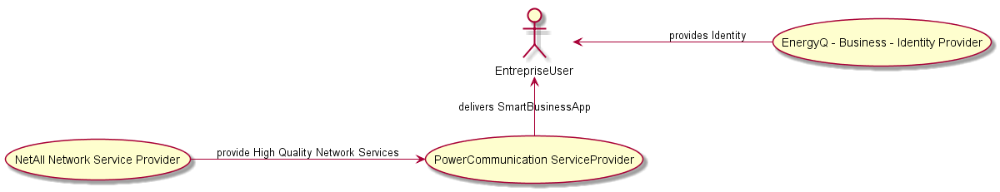

Usage Scenarios Description
===========================

2.6 Enterprise Conversationnal sconario
----------------------------------

### 2.6.1 Scenario Environment

 The Smart Enterprise represents the business life in a smart enterprise. Deliverable D1.1 [2] describes
the scenario as follows:

> Due to multiple recent issues and dissatisfactions, Pierre, the CTO of HyDev Software House, wants to change the Energy supplier of the company.
Following recommendations provided by BigHacker Business Broker, Pierre is able to browse information about recommended suppliers including public conversations available with other clients. He selects one but all sales agents are currently busy.

> An urgent Business Conversation is requested and notified to EnergyQ Smart Supplier followed by Pierre authorization to disclose the context request (including amount of potential annual power consumption of his company) by using his Professional Persona provided by iHackker Business Identity Provider. The notification blinks in Anne's monitor, the sales agent. She is busy in a conversation with another costumer by using her Professional Persona provided by IamPower Business Identity Provider.

> HyDev Persona is instantiated in her device and she checks the asserted context of the notification: an opportunity to get a new costumer due to a partial failure situation of their main competitor. She knows the notification has had already a cost that was paid to BigHacker Business Broker and in case the deal is done another payment will be performed.

> Consequently, there is a potential business opportunity. She then decides to move on with a chat conversation with some additional information and advertisement to hold on the interest of the potential client while she closes the current video conversation with another customer.
As soon as she is free, the chat conversation evolves to a Business Video Conversation thanks to a broadband High Quality Network Gold paid by EnergyQ Smart Supplier to BigHacker Business Broker. The Business Conversation is provided thanks to the collaboration among different services.

>From EnergyQ Smart Energy Supplier side we have:
*  NetALL Network Service Provider;
* Power Communication Service Provider;

> From HyDev Software House side we have:
* NetCITY Network Service Provider;
* HackTalk Communication Service Provider;

> Along this negotiation conversation each side has their own negotiation experience according to their providers and business policies.
Anne needs some support from some other colleagues having more experience with the Software Development sector. She notices that Manuel seems to be available in her sales group with his last image captured a few seconds ago even if Manuel's context says he is jogging. She pushes the button to speak to him.

> She is muted from the negotiation conversation and his image is frozen. Then she speaks to Manuel: "Manuel, I'm in a middle of a negotiation with a very promising opportunity to get a new costumer but I need your help". Manuel hears Anne's voice in his wearable audio device

> and the conversation context she mentions appears in his smartwatch. Manuel, has 20 years of experience see this is a great opportunity in this new customer. Besides, at the end he may also earn a the commission out of the deal.

> He accepts Anne's request and joins the negotiation as a monitoring participant, whispering advices to Anne when needed (only Anne listens). The negotiation is hard but they are able to reach a deal. When the contract is proposed, an Agent from Pierre's Company HackinLaw Legal Services Provider is invited to join the conversation to review the contract.

 In this ecosystem, Anne and her colleagues, use `SmartBusinessApp`, an application provided by Power Communication to Anne's company `EnergyQ`. They use their business identity.

It enables them to manage their communication, internal to the company, like voice, video calls, screen and document sharing, data exchange,  and viewing enriched presence status. Furthermore, `SmartBusinessApp`  is also available to anonymous users (`guests`) visiting EnergyQ website with limited functionalities – mainly instant chat, voice, and video communication.

Depending on customer’s identification and requests, calls can be routed to the appropriate person, like in contact centers model.
For some special appointment, Anne has the ability to schedule calls and meetings in advance with enhanced quality. She also has the ability to record the customer conversations, after having customer agreements to do so.

 

  Figure 1 : SmartBusinessApp logic

### 2.6.2 User perspective

According to the above scenario and to the `SmartBusinessApp` we could distinguish two main types of users: external and internal. Concerning the external users, we have a `Customer` or potential Customer. On the other hand internal users (entreprise agents) of the `SmartBusinessApp`, essentially `the sales agent` and her colleagues (in the above scenario). In the following a more detailed perspective per user type is given below:

 #### 2.6.2.1 Customer Perspective

 As described in the above scenario, customer or potential customer according to the business Roles defined in D1.1 and D2.1, they can benefit from limited functionalities like instant chat messaging, voice and video communication, in ordrer to ensure powerful customer relationships and long sales lifeline. Thus, any customer incoming requests are instantely handelled by entreprise employees. Besides, on the `SmartBusinessApp` the customer will have real time information about available entreprise employees.(See Figure 1)
 

  
 

 

   Figure 2 : SmartBusinessApp Internal view
 

#### 2.6.2.2  Entreprise Agents Perspective

The main functionality of `SmartBusinessApp`, is to use Entreprise website for all business internal communications. Depending on the business identity of the enreprise employees. The  `SmartBusinessApp` provides them not only basic chat, audio and video features, but also extra-features like screen sharing and file transfer. (See Figure 2)

As summary the `SmartBusinessApp` has the following functionalities:

* initiante/Receive video calls or chat, within the Entreprise as well as with the outside.
* Schedule appointments and conference meeting rooms with colleagues and trusted customers outside the Entreprise
* View real time enriched presence of company’s member
* During the calls, Entreprise Agents are able to share screen and document with each other
* For high priority communications, Entreprise Agents are able to use an extra feature that allows to enhance the
quality of video communication.
* Record conversation
* `SmartBusinessApp` may act as virtual assistant, notifying about appointments which facilities to join or notify when customer or another colleague joined in the conference meeting room.
* User Interface is adapted to user environment (PC/mobile)
* Manage connection on multiple devices to facilitate mobility

Use cases from D1.1:
* #1: H2H Conversation with single CSP
* #2: H2H inter-domain Manageable Conversation
* #3: H2H Conversation with decoupled CSP and IdP
* #4: Always Connected with the Trustful Ones
* #67: H2H Conversation with QoS
* #63: H2H Anonymous Conversation
* #64: Human Context Presence Management
* #86: H2H Multiparty Conversations
* #93: Business Identity in H2H Communication
* #94: Context Aware Contact Center
* #95: H2H inter-domain Conversation with different CSPs and external IdPs

#### 2.6.2.3 Identity Management and Trust from user perspective

As previously mentioned, Anne and Manuel are authenticated to `SmartBusinessApp` with their entreprise identity. However, potential customers (anonymous customers) will have guest identity while a personal id will be used for loyal customers, which will authorize them to download the client hyperty in order to communicate with entreprise avaliable employees on the `SmartBusinessApp`. 

#### 2.6.2.4 Interoperability from user perspective

From an external user perspective, customers can use any communication Hyperty from other reTHINK testbeds to communicate with `SmartBusinessApp`.

#### 2.6.2.5 Required policies

* Allow connection to msg node with identity opf the user behind the communication hyperty
* Allow incoming calls from anonymous users to certain registered users only
* Allow presence subscription to authorised users
* Allow QoS calls for authorised users

#### 2.6.3 Required reTHINK Framework Functionalities

The  `SmartBusinessApp` requires the following major reTHINK functionalities:

###### Phase 1
* Hyperty Runtime in Browser
* Hyperty Runtime in Smartphone
* Hyperty server Runtime in Nodejs for rethink group communication
* Nodejs Message Node and its associated Protostub
* A second message node and its associated Protostub to test cross domain H2H
communication interoperability
* Catalogue server as specified in D2.2 [4] supporting protostub descriptors, Hyperty
descriptors, data object schema.
* Domain registry as specified in D2.2 [4] supporting Hyperty instance registration, Hyperty
data object instance registration
* An IdP server and its associated IdP (Proxy) protostub
* Account registration
* Identity login
* Authorisation
* Identity association to Hyperty
* Identity assertion
* Chat and group chat Hyperty
* Human presence using User Status Hyperty
* Group Communication Hyperty

###### Phase 2
* Hyperty runtime in runtime-nodejs to support group communication
* Network services for high quality communications
* Catalogue server as specified in D2.2 [4] supporting protostub descriptors, Hyperty
descriptors, data object schema, Hyperty runtime descriptors.
* Domain registry as specified in D2.2 [4] supporting Hyperty Instance registration, Hyperty
data object instance registration, Hyperty runtime instance registration
* Human / entreprise discovery
* Trust calculation / evaluation
* File sharing
* Screen sharing
* Calendar, notification, recording

#### 2.6.4 Required Testbed features

The following domains should be provided:
* `powercommunication.rethink.orange-labs.fr`
* `energyq.rethink.orange-labs.fr`
* `netall.rethink.orange-labs.fr`

And the following servers (and associated sub-domains) also should be provided:

* Nodejs Messaging Node (`node.powercommunication.rethink.orange-labs.fr`)
* Domain Registry (`registry.powercommunication.rethink.orange-labs.fr`)
* Catalogue server (`catalogue.powercommunication.rethink.orange-labs.fr`)
* IdM Server (`energyq.rethink.orange-labs.fr`)
* QoS Service Broker Service (`broker.netall.rethink.orange-labs.fr`)
* Global Registry
* TURN/STUN server
* Nodejs runtime + MCU server
* Application server (`app.powercommunication.rethink.orange-labs.fr`)

#### 2.6.5 Required Hyperties

As illustrated in figure 3. a list of hyperties used by the SmartBusinessApp:

* WebRTC Group Communication Hyperty (client side), extend the “Connector” hyperty type for group voice and video communication
* Group chat Hyperty, for instant messagingbetween the entreprise agent and the customer
* MyContacts Hyperty, Contact list of registered entreprise agents
* WebRTC Group Communication Hyperty (server side), new hyperty to be developped  on Runtime Node, to handel WebRTC group communication through Kurento WebRTC media server.

 

  Figure 3 : SmartBusinessApp hyperties

