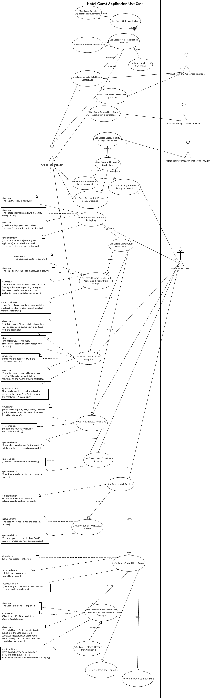

Work In Progress

Dummy Header for Section 1 per ToC
==================================

Usage Scenarios Description
===========================

Hotel Guest Application Scenario
--------------------------------

###Scenario Environment

The _Hotel Guest Application User Scenario_ is situated wihtin a smart economy environment in a smart city, named Bersabon.
Deliverable D1.1 describes the scenario as follows:

> The dedicated meeting place of a conference is the Old Inn Smart Boutique Hotel. 
> It is a small and cozy apartment hotel located in old downtown of Bersabon. 
> The nice old building includes also the Cafe Night&Day and is well known among the digital scene. 
> It targets young entrepreneurs that love enjoying city life in combination with a relaxed place for work and meet. 
> Old Inn takes advantage of advanced IoT technologies where each room can be dynamically and automatically configured to 
> fulfill guest’s preferences including room decoration (e.g. digital paintings and environmental lights), room temperature, 
> mattress stiffness, etc. It also take advantages of being located in a smart city offering tourist recommendations according 
> to real time data provided by smart city of Bersabon services e.g. visit planning, tickets reservation, etc. according to queues 
> length and weather forecast. It was one of the first Apartment Hotels accepting the usage of customer’s power supply 
> contracts in rented apartments. A web application for hotel is available for their guests, so they can choose amenities 
> in advance and control with their guest-room phone/tablet lights, TV, blinds.

In that ecosystem, _Alice_ is the owner of the _Old Inn Smart Boutique Hotel_.  She had requested _The Smarties_, a young startup company 
developping appliances for smart cities, to create an individual application, the _Old Inn Hotel Guest Application_, for their custumors
allowing them to directly book rooms at the hotel, to make individual booking requests, and to control after check-in smart appliances in
the room.  The city of Bersabon hosts a _Cataloge_ that stores and provides as a download various applications to enhance
the experience of staying at Bersabon.  The hosting service is provided free of charge for all local businesses as Bersabon expects
that the service stipulates additional overnight stays of guests in the city which in turn increases revenues from city taxes.
_Alice_ takes advantage of the free service and put The _Old Inn Hotel Guest Application_ in that _Cataloge_.  Also, to stipulate local business, the city of Bersabon hosts free of charge a _Registry_ service, such that all local businesses and "citizens of Bersabon" can obtain a Bersabon-related identity, e.g. an e-mail address in the bersabon.city.com domain.  Based on the good business relation between _Alice_ and _The Smarties_, _Alice_ also ordered a _Hotel Room Control_ application at _The Smarties_ which allows to electronically open the room door and crontrol the light within the room.  The _Hotel Room Control_ is also stored in the _Catalogue_ serviced by the _City of Bersabon_.

_Bob_ is a frequent traveller who stayed at the _Old Inn_ several times before.  The availability of individualized booking and futuristic room control made _Bob_ a returning customer whenever staying at Bersabon.  _Bob_ has signed up with German Telecom, _DT_, to provide him with identity management services.  _DT_ hosts a _Registry_ that implements this service.

As _Bob_ attends the conference at the _Old Inn_, he calls the _Old Inn's Reception_ to ask if the hotel offers any special rates for conference attendees.  The _Old Inn Hotel Guest Application_ informs _Bob_ that the hotel owner, _Alice_, is on duty as a receptionist.  So _Bob_ initiates a voice call with _Alice_. _Alice_ tells _Bob_ that best rates are always available via the hotel's booking portal.

Therefore, _Bob_ uses his smart phone to book a room at the hotel, and select his room preferences. 

When _Bob_ arrives at the hotel, he uses the _Old Inn Hotel Guest Application_ to check-in his room.  During the check-in process, _Bob_ receives credentials to access the hotel's WiFi network.  As part of the check-in process, _Bob_ downloads to his smart phone a _Room Control Hyperty_ to open the door of his room and to control light within his room.  Once the room is ready, _Bob_ may open the door to his room and control the light within it.

**Note:  need to add devices / smart appliances in the room, e.g. control of light etc**

A detailed breakdown of the hotel guest application use case is given in the following figure.

.

###User perspective

*Textual description of the scenario including the main use cases to be supported. Refer as much as possible to use cases defined in D1.1.*

#### Identity Management and Trust from user perspective

*Textual description of Identity Management and Trust aspects from User Perspective*

#### Interoperability from user perspective

*Textual description of interoperability involving the usage of Apps delivered from different Testbed e.g. Audio Call between a Conversation App from DT and a Conversation App from PT*

###Required reTHINK Framework Functionalities

*Detailed analysis of required funcionalities, interfaces and data schemas as specified in D2.2, D3.1 and D4.1. Highlight missing functionalities*

###Required Testbed features

*Identify features required from Testbed operators including Public IPs, number of Docker images/Servers and its characteristics, ports to be opened, .. Use a Network diagram.*

Note that so far only one test bed operator has specified available components [see issues](https://github.com/reTHINK-project/testbeds/issues?utf8=✓&q=is%3Aissue+Constraints+of+Test+Bed+Operators+).  If you sepcify any requirements in access of the specified available components, you might face the situation that the use case might not be run on a available testbed.

###Required Hyperties

*identify required Hyperties, its main functionalities and associated data schemas. Use a graphical language to describe hyperties composition and relationships (to be defined)*
