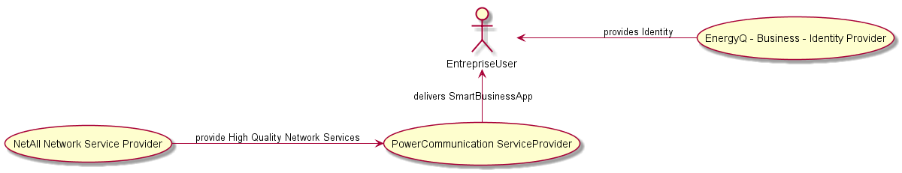

2.6 Enterprise Conversationnal sconario
----------------------------------

### 2.6.1 Scenario Environment

The Smart Enterprise represents the business life in a smart enterprise. Deliverable D1.1 [2] describes
the scenario as follows:

Due to multiple recent issues and dissatisfactions, Pierre, the CTO of HyDev Software House, wants to change the Energy supplier of the company.
Following recommendations provided by BigHacker Business Broker, Pierre is able to browse information about recommended suppliers including public conversations available with other clients. He selects one but all sales agents are currently busy.

>An urgent Business Conversation is requested and notified to EnergyQ Smart Supplier followed by Pierre authorization to disclose the context request (including amount of potential annual power consumption of his company) by using his Professional Persona provided by iHackker Business Identity Provider. The notification blinks in Anne's monitor, the sales agent. She is busy in a conversation with another costumer by using her Professional Persona provided by IamPower Business Identity Provider.

>HyDev Persona is instantiated in her device and she checks the asserted context of the notification: an opportunity to get a new costumer due to a partial failure situation of their main competitor. She knows the notification has had already a cost that was paid to BigHacker Business Broker and in case the deal is done another payment will be performed.

> Consequently, there is a potential business opportunity. She then decides to move on with a chat conversation with some additional information and advertisement to hold on the interest of the potential client while she closes the current video conversation with another customer.
As soon as she is free, the chat conversation evolves to a Business Video Conversation thanks to a broadband High Quality Network Gold paid by EnergyQ Smart Supplier to BigHacker Business Broker. The Business Conversation is provided thanks to the collaboration among different services.

>From EnergyQ Smart Energy Supplier side we have:
*  NetALL Network Service Provider;
* Power Communication Service Provider;

> From HyDev Software House side we have:
* NetCITY Network Service Provider;
* HackTalk Communication Service Provider;

> Along this negotiation conversation each side has their own negotiation experience according to their providers and business policies.
Anne needs some support from some other colleagues having more experience with the Software Development sector. She notices that Manuel seems to be available in her sales group with his last image captured a few seconds ago even if Manuel's context says he is jogging. She pushes the button to speak to him.

> She is muted from the negotiation conversation and his image is frozen. Then she speaks to Manuel: "Manuel, I'm in a middle of a negotiation with a very promising opportunity to get a new costumer but I need your help". Manuel hears Anne's voice in his wearable audio device

> and the conversation context she mentions appears in his smartwatch. Manuel, has 20 years of experience see this is a great opportunity in this new customer. Besides, at the end he may also earn a the commission out of the deal.

> He accepts Anne's request and joins the negotiation as a monitoring participant, whispering advices to Anne when needed (only Anne listens). The negotiation is hard but they are able to reach a deal. When the contract is proposed, an Agent from Pierre's Company HackinLaw Legal Services Provider is invited to join the conversation to review the contract.

 In this ecosystem, Anne and her colleagues, use `SmartBusinessApp`, an application provided by Power Communication to Anne's company `EnergyQ`. They use their business identity.

It enables them to manage their communication, internal to the company, like voice, video calls, screen and document sharing, data exchange,  and viewing enriched presence status. Furthermore, `SmartBusinessApp`  is also available to anonymous users (`guests`) visiting EnergyQ website with limited functionalities – mainly instant chat, voice, and video communication.

Depending on customer’s identification and requests, calls can be routed to the appropriate person, like in contact centers model.
For some special appointment, Anne has the ability to schedule calls and meetings in advance with enhanced quality. She also has the ability to record the customer conversations, after having customer agreements to do so.

 

  Figure 1 : SmartBusinessApp logic

