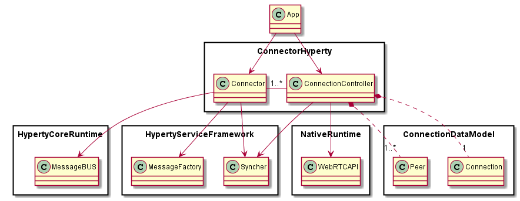
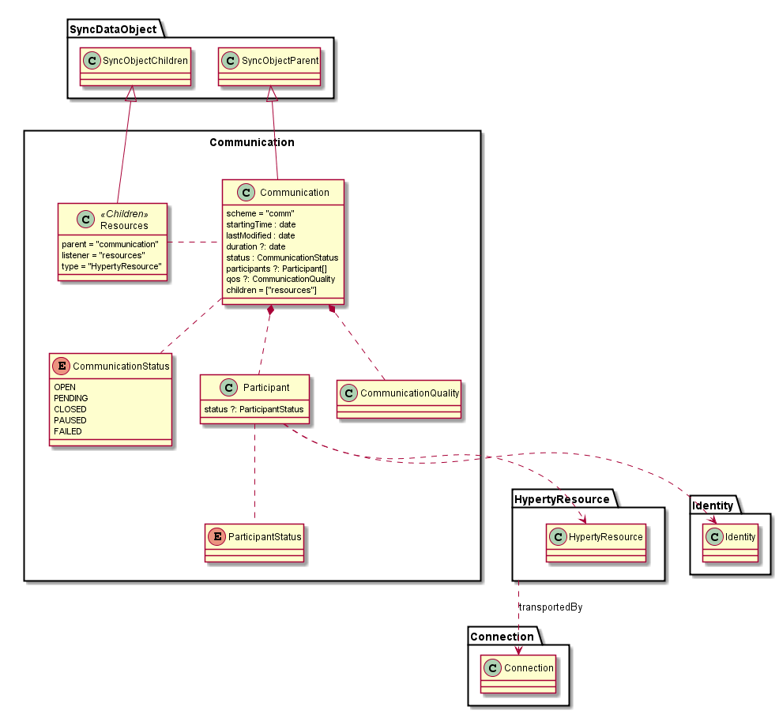
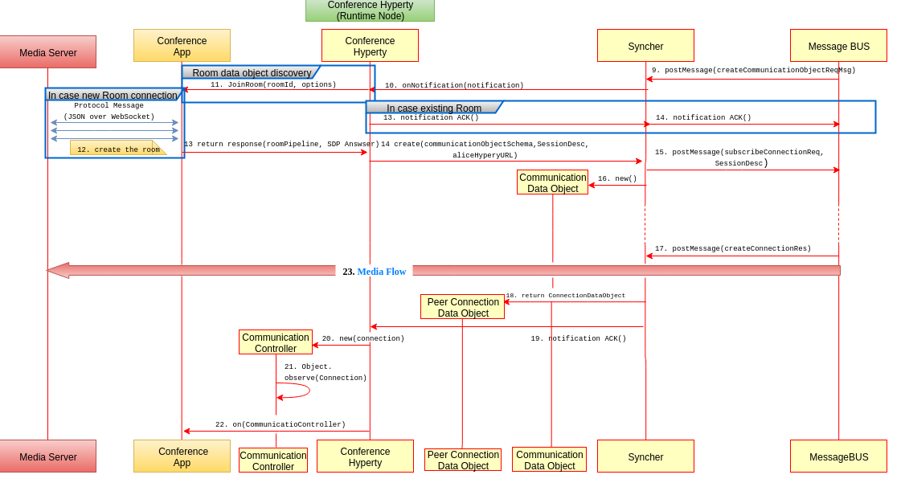

Multiparty WebRTC Communication Hyperty
---------------------------

### Architecture
This section provides specification for the reTHINK WebRTC group communication Hyperty (aka WebRTC Multiparty), enabling WebRTC conference in reTHINK. This hyperty is made of two types of hyperties for cleint and server. 
The client  hyperty ( called Peer Conference Hyperty in D3.5) executed on runtime browser. Besides, a server hyperty ( called Conference Hyperty in D3.5) loaded and executed on Runtime Node, both theses hypeties are defined in D3.5.

### Client conference Hyperty Data Objects schemas

The client conference Hyperty is supposed to be running on runtime browser of user initiating/joining the conference. This hyperty similar to the standard connector hyperty [Connection Data Model](https://github.com/reTHINK-project/specs/tree/master/datamodel/data-objects/connection) , enriched with the ability of handling WebRTC conferencing.(See Figure 1)

       Figure 1: The Connector Hyperty

As illustrated above, the Connector Hyperty handles the connections to the server  conference hyperty. This client hyperty is the Reporter for its connection data object and at the same time observer for the server communication data object per conference room. The same can be said for other participants connection hyperties.

### Client conference Hyperty main call flows

The detailed call flows internal to this hyperty are provided in Figure 2.

  

     Figure 2: Client conference hyperty main call flows

### Server Hyperty Data Objects schemas

The Server hyperty will be loaded and executed in the Runtime Node. This Hyperty handles standard [Communication Data Objects](https://github.com/reTHINK-project/specs/blob/master/datamodel/data-objects/communication/readme.md) extended for WebRTC Group Communication:

  
  

     Figure 3: Communication Data Model

Each conference room (identitfied by roomId) will have its associated room communication data object. This object is created and maintained by the server conference hyperty.

We suppose that this server conference hyperty is up running on Runtime Node waiting for connection incoming requests. This hyperty will have an interesting feature of coordinating multiple data objects, each per room. an orchestrator hyperty.

### Hyperty API

The Group communication Hyperty implements two Hyperty APIs:

#### Client conference Hyperty API

This Hyperty is used to control a connection instance.

**addListener**

This function is used to handle notifications about incoming invitations to join a room.

**Invite**

This function is used to invite a user to join a room.

**onNewParticipant**

This function is used to handle notifications about new participants joins the room.

**joinRoom**

This function creates new connection and sends notification to the server conference hyperty in order to join conference room.

**leaveRoom**

This function is used to send leave message in order to leave the room.

**onParticipantLeft**

This function is used to handle notifications that a participants has left the room.

#### Server conference Hyperty API

This Hyperty is used to control multiple room group communication instcances, a multiparty communication.

**onjoinRoom**

This function used when a new participant requests to join the room group communication instcance.

**createRoom**

This function is fired upon a participant request the server conference hyperty to create a new room group communication instance.

**addParticipant**

This function is used to add or forward invite to a participant in order to join an exisitng room group communication instance.

**removeParticipant**

This function is used to remove a participant from an existing room group communication instance.

**close**

This function is used to deallocate a room group communication instance only when all participants have left the room.

### Main data flows

 The detailed call flows internal to this hyperty are provided in next Figure 3.

   
 

   Figure 4: Server conference hyperty main call flows
 

More detailed specifications are  provided in the following link   https://github.com/reTHINK-project/specs/blob/master/dynamic-view/group-communication/readme.md.
