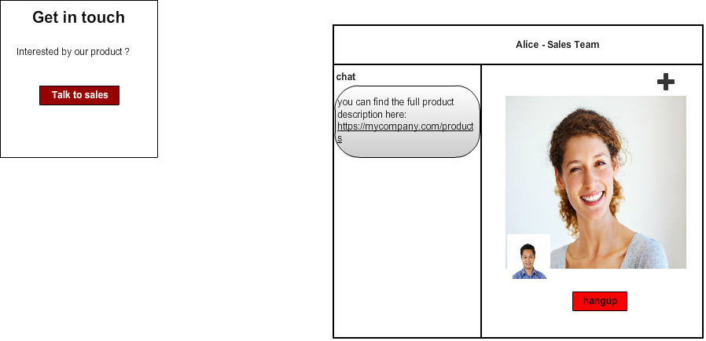

The customer application is a simple Human to Human communication application that allows a simple visitor, with identity or not, to have a call with a connected representative of the company.
Depending on the request, call may be routed to the appropriate person inside the company.

       Figure 1: Entreprise Customer application

