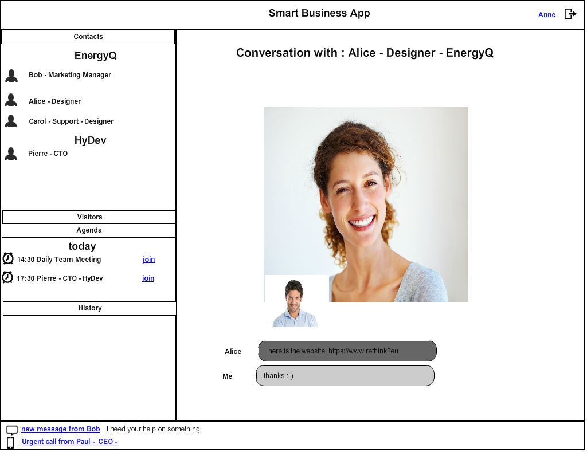
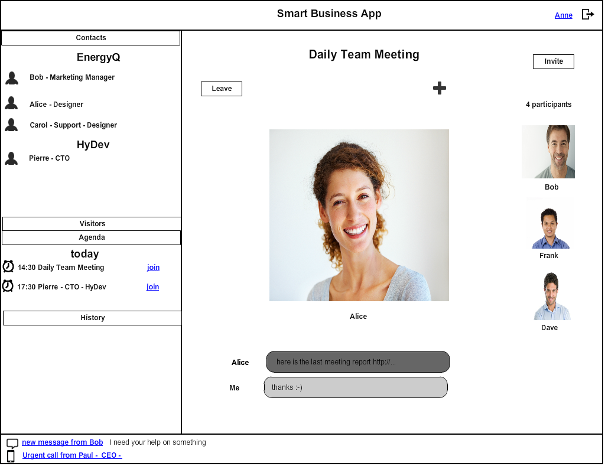

## 4.8 Enterprise application

**Main Dashboard**

The main dashboard allows to have a complete view of business contacts, both inside and outside the company, see the agenda and scheduled video meetings, with the ability to join. It allows
receiving calls with identity display and other type of notification, like new messages, urgent calls waiting, people that have already joined a meeting waiting for you to attend.
The main window displays the active conversation or meeting, with accessible features like chat, data sharing and screensharing.
User can also browse into discussion’s history :

       Figure 69 – Enterprise application

**Multiparty conferences :**

       Figure 70 – Enteprise application – conferences

