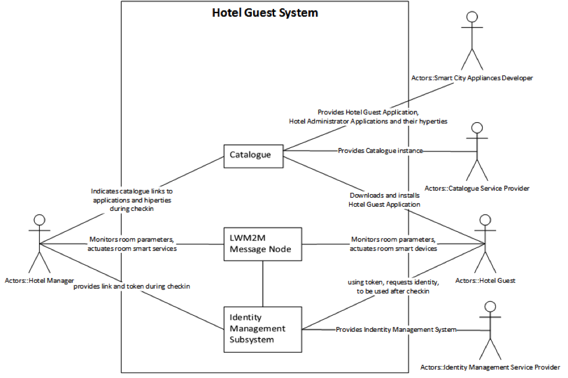

## 2.2 Hotel Guest Application

### 2.2.1	Scenario Environment

The Hotel Guest Application User Scenario is situated within a smart economy environment in a smart city, named Bersabon. Deliverable D1.1 describes the scenario as follows:

> The dedicated meeting place of a conference is the Old Inn Smart Boutique Hotel. It is a small and cozy apartment hotel located in old downtown of Bersabon. The nice old building includes also the Cafe Night&Day and is well known among the digital scene. It targets young entrepreneurs that love enjoying city life in combination with a relaxed place for work and meet. Old Inn takes advantage of advanced IoT technologies where each room can be dynamically and automatically configured to fulfill guest’s preferences including room decoration (e.g. digital paintings and environmental lights), room temperature, mattress stiffness, etc. It also take advantages of being located in a smart city offering tourist recommendations according to real time data provided by smart city of Bersabon services e.g. visit planning, tickets reservation, etc. according to queues length and weather forecast. It was one of the first Apartment Hotels accepting the usage of customer’s power supply contracts in rented apartments. A web application for hotel is available for their guests, so they can choose amenities in advance and control with their guest-room phone/tablet lights, TV, blinds.

In that ecosystem, Alice is the owner of the Old Inn Smart Boutique Hotel. She had requested The Smarties, a young startup company developing appliances for smart cities, to create an individual application, the Old Inn Hotel Guest Application, for their customers allowing them to control after check-in smart appliances in the room. The city of Bersabon hosts a Catalogue that stores and provides as a download various applications to enhance the experience of staying at Bersabon. The hosting service is provided free of charge for all local businesses as Bersabon expects that the service stipulates additional overnight stays of guests in the city which in turn increases revenues from city taxes. Alice takes advantage of the free service and puts the Old Inn Hotel Guest Application in that Catalogue. The hyperty that Alice ordered at The Smarties allows for room monitoring and control, i.e. guests that have a (time limited) access token granting them access to the room may electronically opening the room door and controling the light within the room. This hyperty is provided free of charge to 3rd Party companies so that they can integrate the functionality in applications or identity-based search engines. 

Benjamin is a frequent traveler who stayed at the Old Inn several times before. The availability of futuristic room control made Benjamin a returning customer whenever staying at Bersabon. Benjamin has signed up with Deutsche Telekom to provide him with identity management services.  

As Benjamin attends the conference at the Old Inn, he asks his travel department to arrange for a booking at the Old In Hotel.  The travel department arranges a booking and places the booking information alongside with the access credentials for the room in Benjamin's personalized information retrieval system.  Additionally, the traval department send Benjamin an e-mail with a link that points to the Application allowing to open to room and control the room appliances; the link includes the personalized room-access toked received during the reservation process.

When Benjamin arrives at the hotel, he uses the Old Inn Hotel Guest Application to access his room. The application also provides information on user credentials to use the hotel's local wireless network and attempts to connect Benjamin's smart devices directly to the WiF network in order to reduce data sent over cellular connections. Benjamin may open the door to his room and control the light within it and can monitor the temperature from his room.

While the access token that Benjamin has received only grants access to the reserved room for the duration of the reservation, the same application allows via a priveledged administrator token to access all hotel rooms. A Hotel Administrator Application may hence open the room door in case of emergency even if a guest electronically locked it.

### 2.2.2	User perspective

Alice, the owner of the hotel is happy to be able to buy new sensors and easily configure and have them operational using the technology provided from D1.1 use case 5 “M2M Always Connected in Trustful Domains for Multi vendor devices”. The hotel owner and the hotel guest share trustfully access to the data collected from multiple sensors, feature enabled by D1.1 use cases 6 “M2M Seamless connected from different but Trustful domains” and  7 “Information reception from a sensor”.

#### 2.2.2.1	Identity Management and Trust from user perspective

Both the hotel owner and the hotel guest trust the identity management from the Identity Management Subsystem guaranteeing together with the Hotel LWM2M Message Node that access to data collected from the sensors deployed in the room and actuating on the room actuators is properly authenticated and only authorized users have access to it. Access to a room is based on access-tokens provided during the reservation process.

#### 2.2.2.2	Interoperability from user perspective 

The Hotel Guest Application will be integrated in the Participate application in which other use cases referring to Audio-Video conversations, chat are enabled. Using the reTHINK Last Hop Connectivity Broker (LHCB) allows for local connectivity management, i.e. switching the connection of mobile devices to the hotel's WiFi.

#### 2.2.2.3	Required polices

The usecase demands user roles in monitoring and actuating smart devices. Such roles are authenticated via tokens. More exactly, the administrator role will have higher authority (token) in actuating than the hotel guest, e.g. for opening the room door in case of emergency.

### 2.2.3	Required reTHINK Framework Functionalities

From D3.1 and D3.5 the directly used components are the Runtime User Agent, the QoS User Agent and the Identity Hiperty. The Runtime User Agent is used by the hotel guest to to download the hotel guest application and hiperties; this process requires user identification in the system via the Identity Hyperty / runtime environment. The QoS User Agent, namely the interface of it to the LHCB, is used to request switching the mobile device's connection to the hotel's WiFi network. The Hotel Room Monitor and Control Hiperty is used to monitor and control smart appliances in the hotel room.
From reThink Identity Management (D4.1 and D4.4) the used components are the Catalogue and the Identity Management Server. The Catalogue enables the end devices to dynamically download and refresh the downloaded version of the hyperties based on request from the Runtime User Agent. The indentity Management Server is capable of generating a temporary identity of the hotel guest and authenticate it when request is received from the LWM2M Message Node.

### 2.2.4	Required Testbed features

The testbed needs to provide:
  * a catalogue to store required hyperties, protostubs, etc.;
  * an identity management services;
  * a message node for communicaiton between hyperties;
  * a LWM2M Message Node and Server to connect the smart appliances of the hotel rooms to; and
  * at least one real smart appliance (e.g. a light bulb) to visualize the control of smart appliances in a hotel room.
 
Additionally, a web cam showing the status of the light bulb may be benificial for demonstrations in which the light bulb needs to be be conroled remotely.

The light bulb and (optional) web cam as well as the LWM2M server should be accessible from remote locaitons in order to fascilitate easy demonstrations of reTHINK Hotel scenario regardless of the need to bring physical smart appliances to the location at which the demonstrations takes place.

### 2.2.5	Required Hyperties
The use case demands a couple of applications and Hyperties.
In the Hotel Guest Application there are two Hyperties needed: Hotel Connectivity Hypertyand Room Monitor and Control Hyperty. The Hotel Administrator Application also makes use of the Room Monitor and Control Hyperty with credentials recognized by the LWM2M Message Node through the Identity Management Server with a role to override the hotel guest actions and has access to all the hotel rooms.

