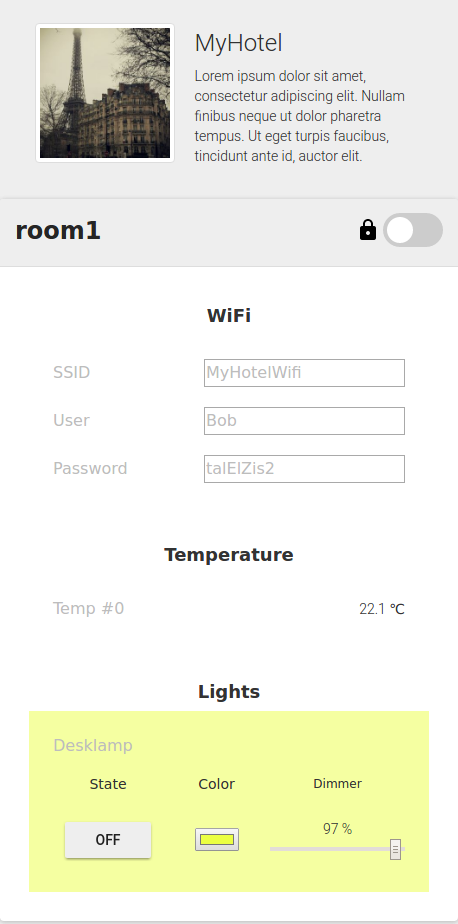

## 4.3 Hotel Guest & Hotel Manager application 

Both, the *Hotel Guest Application* and the *Hotel Manager Application* allow to control smart appliances, here, in 
hotel rooms. As access to appliances within a hotel room is controlled via access tokens, both application largely build
upon a joint implementation which utilizes access-tokens granting control over only a single hotel room, as it is the
case for the guest version, or granting control over all available rooms, as for the hotel manager.  In addition, the
*Hotel Manager Application* provides means to open locked doors for all hotel rooms or a single room, even if guests
have checked in; this copes for emergency scenarios such as fire in the hotel; when first responders need to immediately
access all rooms.

The application provides in particular the following features based on the set of used smart appliances in the
demonstration set-up:
  * Display Wifi credentials for the corresponding WiFi Account assigned to the hotel room
  * Allows to lock / unlock the room door
  * Provides feedback if the room door is locked or open.
  * Controlling the luminosity of the light in the room
  * Control the color of the light in the room
  * Provides a temperature reading in the room

In addition, the application integrates a web-cam based visual feedback of the light controlled by the application in
the room to allow for "remote demonstrations" of the usage scenario.

The application provides means to open all rooms for which the used access-token grants access privileges.

The following screenshot shows the GUI of the application:

