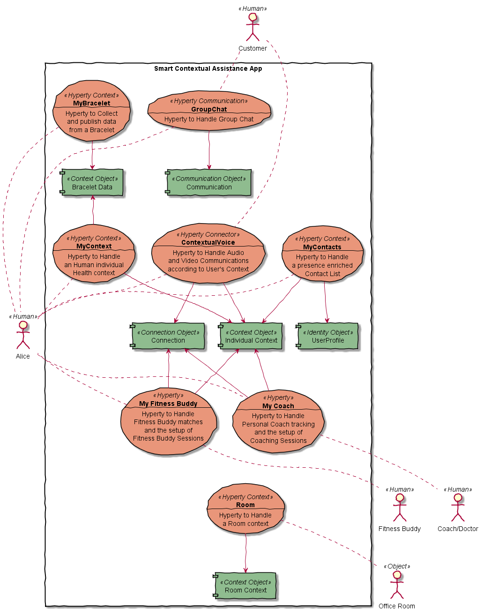

Smart Contextual Assistance
---------------------------

### Summary

The Smart Contextual Assistance scenario is based on [D1.1 Contextual Enriched Communication in Smart Enterprises](https://github.com/reTHINK-project/use-cases/wiki/Contextual-Enriched-Communication-in-Smart-Enterprises) and is supported by an App delivering Human to Human communication and Human to Machine communication (IoT) features that automaticaly adapt according to users context. Thus, it behaves as a Smart Business Assistance app when the user is in a Work context or it behaves as a Smart Personal Assistance app when the user is in a Personal context. The Smart Business Assistance enables Alice to collaborate with co-workers, external partners using other similar applications, as well as with customers. In addition, the Smart Business Assistance enables Alice to control office rooms. The Smart Personal Assistance manages personal communications, enables the control of smart home devices and provides a personal wellness coach to assist user's wellbeing.

User's context can be derived from different sources including:

-	location
-	wearable devices including bracelet
-	communication parties
-	sensors in Alice's mobile
-	sensors in physical places where Alice is located
-	calendar
-	opened web documents

#### Summary of Required functionalities

The Smart Contextual Assistance requires the following major reTHINK functionalities:

**Phase 1**

-	Hyperty Runtime in Browser
-	Hyperty Runtime in Smartphone
-	Vertx Message Node and its associated Protostub
-	A second Message Node and its associated Protostub to test cross domain H2H Communication interoperability
-	Catalogue server as specified in D2.2 supporting protostub descriptors, Hyperty descriptors, Data Object Schema.
-	Domain Registry as specified in D2.2 supporting Hyperty Instance registration, Hyperty Data Object Instance registration
-	An IdP server and its associated IdP (Proxy) protostub
-	Account registration
-	Identity login
-	Authorisation
-	Identity association to Hyperty
-	Identity assertion
-	Chat and Group Chat
-	Human Presence

**Phase 2**

-	Hyperty Runtime in Nodejs
-	Discovery service
-	Hyperty Runtime in Kurento Media Server to support Group Communication
-	Catalogue server as specified in D2.3 supporting protostub descriptors, Hyperty descriptors, Data Object Schema, Hyperty Runtime descriptors.
-	Domain Registry as specified in D2.3 supporting Hyperty Instance registration, Hyperty Data Object Instance registration
-	Global Discovery
-	Machine / Object Discovery
-	Trust calculation / evaluation
-	File Sharing
-	Device Control / Actuation

### Scenario Environment

The Smart Contextual Assistance scenario is based on [D1.1 Contextual Enriched Communication in Smart Enterprises](https://github.com/reTHINK-project/use-cases/wiki/Contextual-Enriched-Communication-in-Smart-Enterprises). Stakeholders and Business Roles involved in the Smart Contextual Assistance scenario are the following:

-	HyBroker is a Business Broker managing an ecosystem of different partners including HySmart which is an expert on IoT Hyperties
-	HyBroker delivers Smart Business Assistance App in a partnership with HySmart
-	HyBroker also delivers communication (ie plays the CSP role) and Identity Hyperties (ie plays the IdP role)
-	HyBroker provides a Global Registry
-	Alice is an individual end-user (service consumer) that works for HyDev Software House (organization consumer), which provided her a Smart Work Assistance App to support her in the Job.
-	Alice is free to use an Identity provided by HyBroker or by others trustful IdPs like the iHacker IdP
-	Smart Business Assistance enables Alice to collaborate with co-workers, external partners using other similar applications, as well as with customers.
-	Smart Business Assistance enables Alice to control some office devices.
-	Smart Business Assistance is also used for occupational safety and health purposes through a bracelet wared by Alice.
-	Alice has subscribed additional Smart Contextual Assistance features, with a special discount, to be used in a personal context ie acting as a Smart Personal Assistance App, enabling Alice to manage personal communications, to control her smart home devices and well being.

### User perspective

The Smart Contextual Assistance Apps automatically adapts its behavior according to Alice's context including location (office room or home room) context, activity and communication context. Two main Alice's context's are considered: Work context and Personal context.

Alice context can be derived from different sources including:

-	location
-	wearable devices including bracelet
-	communication parties
-	sensors in Alice's mobile
-	sensors in physical places where Alice is located
-	calendar
-	opened web documents

The following WP1 Use Cases are required:

-	[H2H Conversation with single CSP](https://github.com/reTHINK-project/use-cases/issues/1)
-	[Messaging / Chat](https://github.com/reTHINK-project/use-cases/issues/35)
-	[H2H inter-domain Conversation with different CSPs and external IdPs](https://github.com/reTHINK-project/use-cases/issues/95)
-	[H2H Multiparty Conversations](https://github.com/reTHINK-project/use-cases/issues/86)
-	[Context-Aware Contact Center](https://github.com/reTHINK-project/use-cases/issues/94)
-	[Business Identity in H2H Communication](https://github.com/reTHINK-project/use-cases/issues/93)
-	[Human presence](https://github.com/reTHINK-project/use-cases/issues/47)
-	[Registering Devices](https://github.com/reTHINK-project/use-cases/issues/66)
-	[M2M Always Connected in Trustful Domains for Multi-vendor devices](https://github.com/reTHINK-project/use-cases/issues/5)
-	[Information reception from a sensor](https://github.com/reTHINK-project/use-cases/issues/70)
-	Device Control

#### Work Context

In Work Context three main Use Cases are supported by the Smart Contextual Assistance app:

-	Smart Working provides Occupational safety and health features
-	Business Communication and Cooperation
-	Office Automation

##### Smart Working (Occupational safety and health)

While Alice is in a Work Context, Alice health and activity is continuously monitored through her bracelet for occupational safety and health purposes. Alice's personal data is collected according to applicable labor laws and she is able to fully control it.

Occupational safety and health doctors can remotely track Alice's health, giving advice and setting up remote occupational safety and health multimedia appointments to coach her.

##### Office Automation

When Alice context is "located in the Office" a few office automation features (see picture below) her available from the Smart Business Assistance app.

##### Business Communication

Alice context can also be set according to the communication party (see figure below), namely:

-	Customer Context: Alice is in a communication session with a Customer
-	co-worker Context: Alice is in a communication session with a co-worker
-	Partner Context: Alice is in a communication session with a Partner

On the other hand, according to the context status, the communication experience is adapted in order to make it as effective as possible, e.g. Alice Identity selection and associated user profile data, availability of communication features like video, etc.

Alice's communication experience is adapted according to Alice's context. For example:

-	in a customer context, only a small group of people can reach Alice including the customer account manager and her boss. The most relevant information about the customer history is highlighted in the UI according to conversation topic.

**Customer Context**

The Smart Contextual Assistance provides a Web Contact Center feature where each employee can play the role of the Agent for a previously scheduled slot. Thus, customer communication requests are routed to employees according to its Agent availability status. During Costumer conversations, the agent can display product related material and also sell products. At the end, Agent can be immediately awarded according to the outcome of the customer conversation.

The picture below depicts the different Customer Communication Use Cases.

**co-worker context**

In the co-worker context, besides the basic chat, audio and video features, the App also provides collaboration features like screen sharing and file transfer, which are organised according to the topic of the conversation which should be very much project oriented.

**partner context**

Similar to co-worker context. The big difference is that the organisation of sharable resources during the conversation depends on the related partnership project.

#### Personal Context

In Alice's Personal Context, three main use cases are supported:

-	smart living that uses a personal bracelet to support Alice's Wellbeing
-	Home Automation
-	Personal Communication

##### Home Automation

When Alice context is "located in her home" a few Home automation features (see picture below) her available from the Smart Personal Assistance app.

##### Smart Living

Alice health is continuously monitored through her bracelet and she follows a strict workout program to keep her in a good shape. Alice workout includes sessions in her gymnasium and outside her gymnasium (e.g. biking and running). Alice activity is continuously monitored by the App who also reminds her about workout activities to be performed. Alice's personal coach can remotely track Alice's performance, giving advice and setting up remote multimedia sessions to coach her (in a group or individually, according to subscribed workout program).

Workout Assistance App also enables her to meet and join other people following similar Workout programs. For example, during fitness sessions the App can also recommend to setup remote sessions at the same time and do fitness together as if they were in the same location. During these Do Remote Fitness Together Session, users can share in real time workout performance indicators in order to motivate each other.

Alice activity and health monitoring produce Alice Health Context and Alice Activity status inferred according to some AI algorithms.

##### Personal Communication

Alice's communication experience is adapted according to Alice's context, namely:

-	when training, only a small group of people can reach Alice including people from Alice's personal contact list and work contact list.
-	when training (or on the go), the focus is on voice user interface to handle communication (including ongoing communications).

Alice context can also be set according to the communication party including friends and relatives.

#### Identity Management and Trust from user perspective

As mentioned below, Alice identity selection will depend on her context. For example, Enterprise Identity will be used for anonymous customers while a personal Identity will be used for loyal Customers. Trust will also be set according to selected identities.

#### Interoperability from user perspective

Customers and Partners can use any application from other testbeds to communicate with Smart Contextual Assistance App.

Smart Contextual Assistance App office and home automation features should be able to be used in the Hotel Guest scenario when appropriately authorized by the Hotel management. The other way around should also be possible.

#### Required Policies

The following Policies should be available for the Smart Contextual Assistance scenario:

-	access control to Context data collected from the bracelet (ie policies applied to subscription requests to ContextURL where Bracelet data is published to) according to identities (eg to Occupational safety and health doctors, Fitness Coach or that they work on behalf of some Occupational), date / time and user context (including location and communication context).
-	similar to previous one but now applied to higher level inferred Context data processed by the MyContext Hyperty. These policies can be applied to decide eg what level of context data should be provided to MyContacts Hyperty and when displaying info about the user requesting a communication.
-	policies to control communication requests according to user context and the identity of the requester. Possible actions: notify user, reject request, play audio/video, send notification, execute bot to collect further information about the communication request.
-	policies to change the Room context according to the User Context and its Identity. Possible actions: turn on lights and set temperature to a certain value
-	Policies to match user profiles and user contexts

### Required reTHINK Framework Functionalities

The Smart Contextual Assistance requires the following major reTHINK functionalities:

-	Hyperty Runtime in Browser
-	Hyperty Runtime in Smartphone
-	Hyperty Runtime in Raspberry PI
-	Hyperty Runtime in Kurento Media Server to support Group Communication
-	Vertx Message Node and its associated Protostub
-	*partner1* Message Node and its associated Protostub to test cross domain H2H Communication interoperability
-	*partner2* Message Node and its associated Protostub to test cross domain M2M Communication interoperability
-	*partner3* Message Node and its associated Protostub to test cross domain H2M Communication interoperability
-	Catalogue server as specified in D2.2 supporting protostub descriptors, Hyperty descriptors, Data Object Schema.
-	Domain Registry as specified in D2.2 supporting Hyperty Instance registration, Hyperty Data Object Instance registration
-	At least two different IdP servers and its associated IdP (Proxy) protostub
-	Discovery service

The following APIs and Procedures are required:

-	Account registration
-	Identity login
-	Authorisation
-	Identity association to Hyperty
-	Identity assertion
-	Human Discovery
-	Machine / Object Discovery
-	Trust calculation / evaluation
-	Chat and Group Chat
-	Human Presence
-	File Sharing
-	Screen Sharing
-	Device Control / Actuation

### Required Testbed features

The following domains should be provided:

-	hybroker.rethink.ptinovacao.pt
-	hysmart.rethink.ptinovacao.pt
-	iHacker.rethink.ptinovacao.pt

HyBroker should provide the following servers (and associated sub-domains):

-	Vertx Messaging Node (msg-node.hybroker.rethink.ptinovacao.pt)
-	Domain Registry (registry.hybroker.rethink.ptinovacao.pt)
-	Catalogue server (catalogue.hybroker.rethink.ptinovacao.pt)
-	IdM Server (?) (idm.hybroker.rethink.ptinovacao.pt)
-	Global Registry
-	TURN/STUN server

HySmart should provide the following servers (and associated sub-domains):

-	Domain Registry (registry.hysmart.rethink.ptinovacao.pt)
-	Catalogue server (catalogue.hysmart.rethink.ptinovacao.pt)

### Required Hyperties

The following Hyperties are required for the Smart Contextual Assistance scenario:

-	MyContacts Hyperty to handle a presence (context) enriched contact list.
-	MyBracelet Hyperty which collects and publishes data from a bracelet
-	MyContext Hyperty which processes and infers context data from different context sources including from the Bracelet Hyperty
-	ContextualVoice Hyperty which extends a basic Connector Hyperty to handle WebRTC based audio and video connections according to User's context
-	Group Chat Hyperty to provide Chat in a group of users
-	MyCoach Hyperty supports remote fitness sessions
-	MyFitness Buddy support workouts with remote fitness buddies
-	Room Hyperty support Home Automation features

