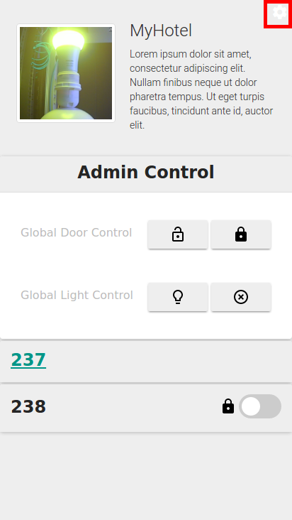
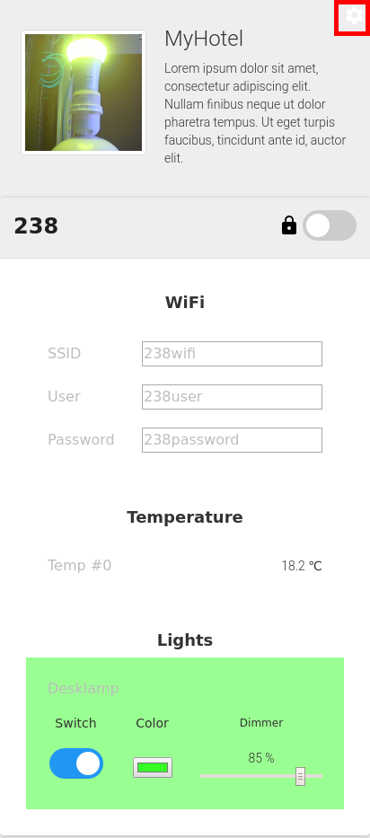

### 4.4.1	Hotel Guest and Administrator Application (UPDATE FOKUS)	

The Hotel Guest Application and the Hotel Manager Application allow to control smart appliances, here, in hotel rooms. As described in D5.1 Revision 1, the applications provide in particular the following features based on the set of used smart appliances in the
demonstration set-up:
  * Display Wifi credentials for the corresponding WiFi Account assigned to the hotel room
  * Allows to lock / unlock the room door
  * Provides feedback if the room door is locked or open.
  * Controlling the luminosity of the light in the room
  * Control the color of the light in the room
  * Provides a temperature reading in the room
  
  As part of the developments in Phase II of reTHINK, support for controlling the network connectivity was added as such as the devices that runs the hotel guest application automatically connects to the password-protected WiFi network of the hotel for which the BSS ID password is provided via the application. Additionally, the disign of the GUI was slightliy modified in order to include a video live stream of the lamp in the hotel room to allow for demonstrating the application without the need to physically move the installments in the hotel room.  The following figures show screenshots of the final hotel administrator application and hotel guest application.
  

