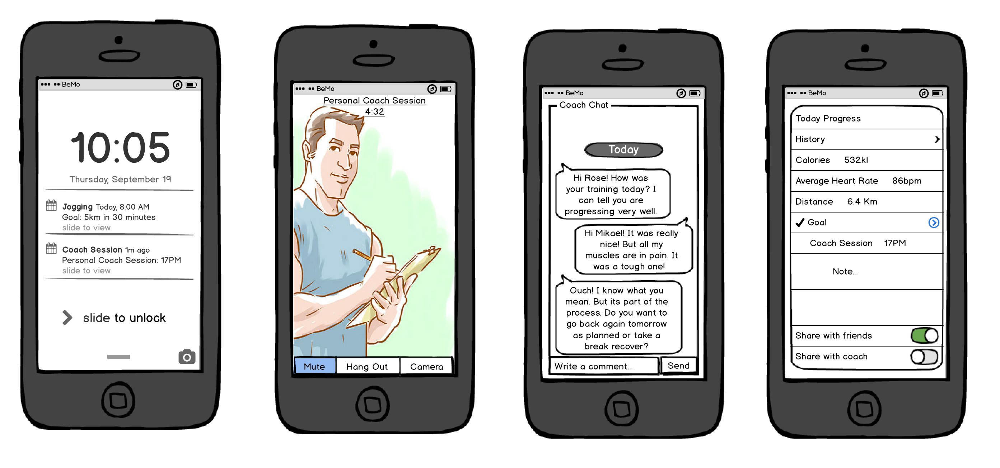

Dummy Header for Section per ToC
================================

Scenario Applications Specification
===================================

Application_Name_1_Include_Title_here
-------------------------------------

### Architecture

*Describe main Application functionalities. Describe main internal component architecture with a class diagram.*

### Smart Phone User Interface

#### Fitness Context

Mobile Smart GUI Fitness.

#### Chat Conversation

This UI is to Support Chat Conversations.

#### Audio Conversation

This UI is to Support Audio Conversations.

#### Video Conversation

This UI is to Support Video Conversations.

#### Account Settings

This UI is used to set User Account settings including Id to be used.

#### Contacts Management with Presence

This UI is used to manage contacts enriched with presence including:

-	Browse Contacts
-	Search Contacts
-	Add/Remove Contacts
-	Setup Conversations

#### Contact Edition

This UI is used to edit a contact

#### Context Status

This UI is to Consult User Context.

#### Discovery

This UI is to Discover users and contexts.

#### Room Control

This UI is used to monitor and control devices in a room.

### Browser UI
