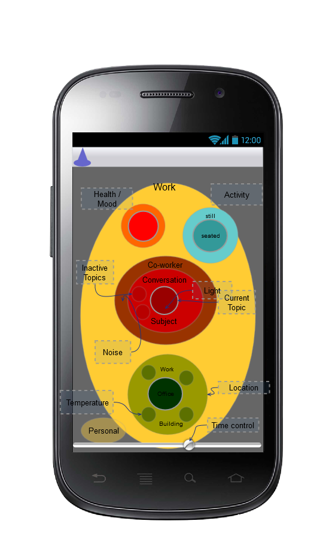
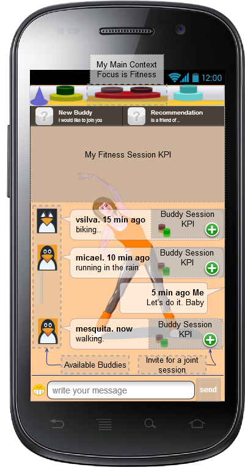

Dummy Header for Section per ToC
================================

Scenario Applications Specification
===================================

Application_Name_1_Include_Title_here
-------------------------------------

### Concepts and Architecture

*Describe main Application functionalities. Describe main internal component architecture with a class diagram.*

The Smart Contextual Assistance applications provides Contextual Communications and Connected Devices control. The user experience is automatically adapted according to user context in order to improve user focus and effectiveness.

The picture below depicts the Context Concept landscape view concept that will be researched in terms of User Interface design to express a User Context composed by different types of context (e.g. location, activity, availability, etc ) each one having different levels of detail (eg work -> Customer Conversation -> Subject).

Such context landscape view can be displayed in a 2D screen display as shown below and browsing through the Context Landscape in touchscreen devices can be done with swipe gestures.

### Smart Phone User Interface

#### Top Header

The top header contains the User Context which gives access to different sets of assistance features.

#### My Context

A complex Work user context example is shown below.

#### Fitness Context

Mobile Smart GUI Fitness Timeline.

This UI is the focus when the user is in a Fitness Active context status.

This UI is the focus when the user is in a Fitness Buddy Audio context status.

This UI is the focus when the user is in a Fitness Buddy Video context status.

#### Contacts Management with Presence

This UI is used to manage contacts enriched with presence including:

-	Browse Contacts
-	Search Contacts
-	Add/Remove Contacts
-	Setup Conversations

#### Contact Edition

This UI is used to edit a contact

#### Context Status

This UI is to Consult User Context.

#### Discovery

This UI is to Discover users and contexts.

#### Room Control

This UI is used to monitor and control devices in a room.

### Browser UI
