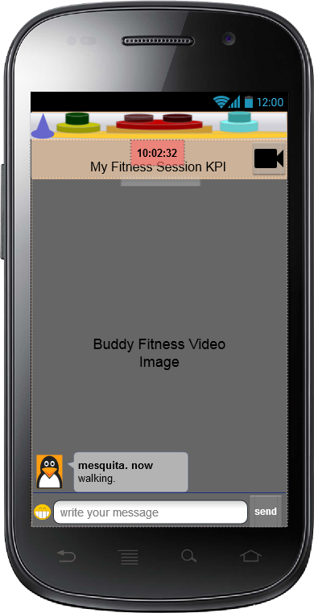
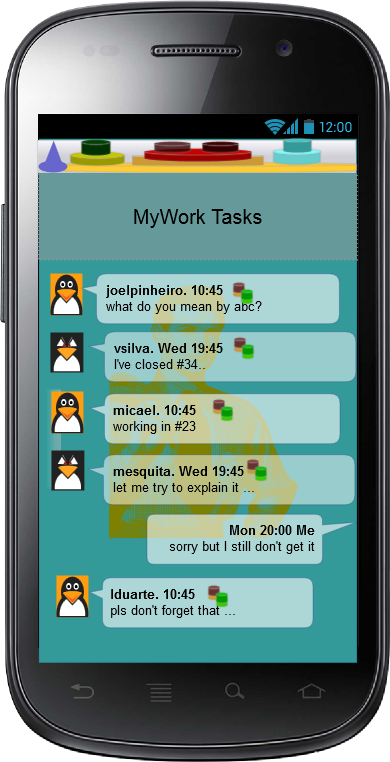
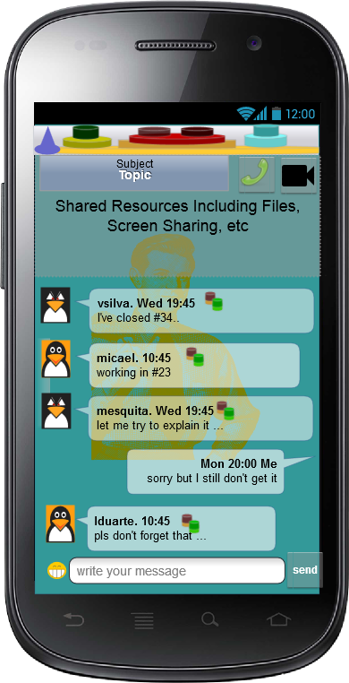
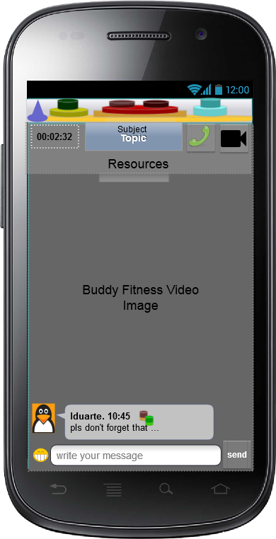

Dummy Header for Section per ToC
================================

Scenario Applications Specification
===================================

Application_Name_1_Include_Title_here
-------------------------------------

### Concepts and Architecture

*Describe main Application functionalities. Describe main internal component architecture with a class diagram.*

The Smart Contextual Assistance applications provides Contextual Communications and Connected Devices control. The user experience is automatically adapted according to user context in order to improve user focus and effectiveness.

The initial version will focus on Co-worker Business Conversation context and Personal Fitness context, using data collected from a connected Bracelet. The following Hyperties will be used:

-	MyBracelet Hyperty to collect and publish data from a connected bracelet
-	MyContacts Hyperty to manage Contextual enriched contact lists or groups
-	GroupChat Hyperty to support chat communication with group of users
-	Connector Hyperty to support Audio and Video communication with users
-	MyContext Hyperty to process and infer User Context from different sources including MyBracelet, Communication related Hyperties.

The picture below depicts the Context Concept landscape map view concept that will be researched in terms of User Interface design to express a User Context composed by different types of context (e.g. location, activity, availability, etc ) each one having different levels of detail (eg work -> Customer Conversation -> Subject).

Such context landscape view can be displayed in a 2D screen display as shown below. Browsing through the Context Landscape in touchscreen devices can be done with swipe gestures.

### Smart Phone User Interface

In the next sections, initial UI concepts for a Smart Phone device are provided.

#### Context in general

The top header contains a User Context landscape silhouette which gives access to different sets of assistance features.

When tapped, the top header will expand into a browsable Context Landscap map as the example shown below, which contains different types of context with different layers of detail. At the bottom, there is a time control cursor enables to move the context backward or forward in time (timescale should be set in settings)(probably this will only be provided in phase 2).

#### Fitness Context

This section provides initial UI concepts for the Fitness Context. By default, when the Fitness context is selected or automatically triggered, the home screen is the Fitness Timeline, which contains:

-	at the top a summary of a Fitness report and the next workout program activities
-	the list of user Fitness Buddies each one with the last fitness message, Fitness Context silhouette and a summary of the Buddy fitness results that are visible to the user. When tapped, the Buddy Context silhouette is expanded into a browsable Context Landscap map in a away similar to the example shown above. However, in this case, the visible context landscape map should be less detailed and riched and defined according to access control policies.
-	there is a command button to start a specific Fitness Session from the User Fitness Landscape maps (not shown)

When a Fitness Session starts (eg when the user selects from the UI before or a Fitness Activity Context is inferred by the MyContext Hyperty), the Fitness Session UI is activated, which contains:

-	Messages exchanged between the active Fitness Buddy User Group ie other Fitness Buddies that are also in a Fitness Session. Each message entry includes a summary of the Buddy Fitness KPIs and a command to invite for a Buddy Session.
-	Graphics with real time analysis of Key Performace Indicators from the Fitness Session (to be researched if these KPIs can also be represented with a specific Fitness Context landscape map).
-	at the bottom an input form to write and send chat messages to Fitness Buddies
-	at the top some notifications can appear with new Buddy invitations or new Buddy recommendations

When the user is in a Buddy Session ie the Fitness Session is jointly performed with a remote Buddy with an Audio connection, the Buddy Session UI is activated, which contains:

-	the same Graphics with real time analysis of User Key Performace Indicators.
-	the real time analysis of the Key Performace Indicators shared by the session Buddy.
-	Notification of new messages of other active Buddies
-	Icon to signal an on going Buddy session which can also be used to close the session
-	at the bottom still an input form to write and send chat messages to Fitness Buddies (should it be hidden by default?)
-	Fitness notifications can still appear at the top

The Buddy session can also support Video as shown below. In this case the focus can be either the video or the KPIs graphics (should the graphics be displayed on top of the remote Buddy video?)

#### Work Context

This section provides initial UI concepts for the Work context. By default, when the Work context is selected or automatically triggered, the home screen is the Work Timeline, which contains:

-	at the top a summary of a Work tasks and work appointments.
-	the list of co-workers each one with the last message and a Work Context silhouette. Similar to the Fitness Buddy context, when tapped, the Work Context silhouette is expanded into a browsable Context Landscap map.
-	there is a command button to start a specific Work Conversation from the User Fitness Landscape maps (not shown)

When a Work Chat Session starts ro is resumed (eg when the user selects from the UI before), the Conversation Chat Session UI is activated, which contains:

-	Messages exchanged among the participants in the Group.
-	Resources shared in the conversation including files and Screen. The size of this window can be adjusted eg for screen sharing it can be similar to the video window (see below). In addition, Graphics with real time analysis of the content of the conversation (eg who is the most active participant, words that are more used, etc) can also be shown (to be researched if these KPIs can also be represented with a specific Chat Conversation Context landscape map).
-	at the bottom an input form to write and send chat messages to the Work Group.
-	at the top the conversation subject and topic as well as commands to start/stop audio, video or screen sharing as well as to share files / pictures (not all shown).
-	at the top some notifications can appear with new messages from other groups (not shown).

The Conversation can also support Video as shown below. In this case the focus can be either the video or the Shared Resources plus the KPIs graphics (should the graphics be displayed on top of the remote Buddy video?)

