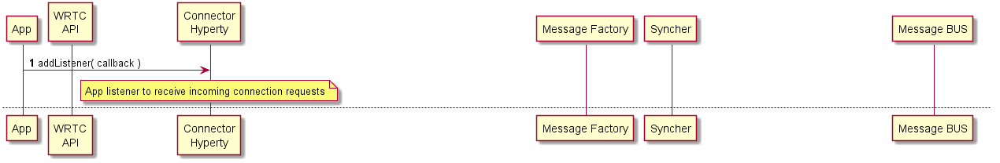
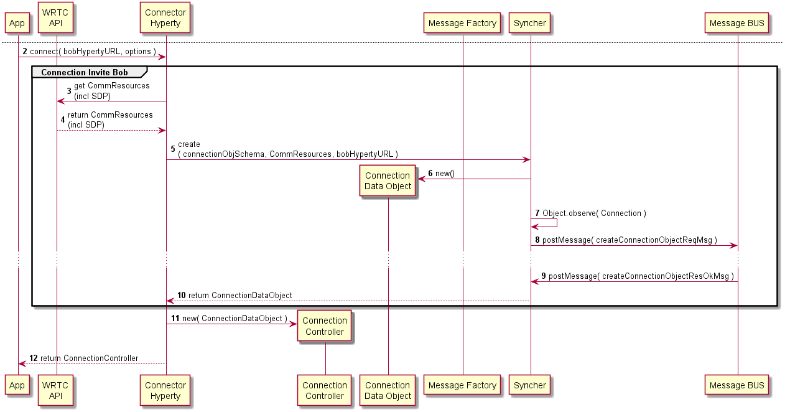
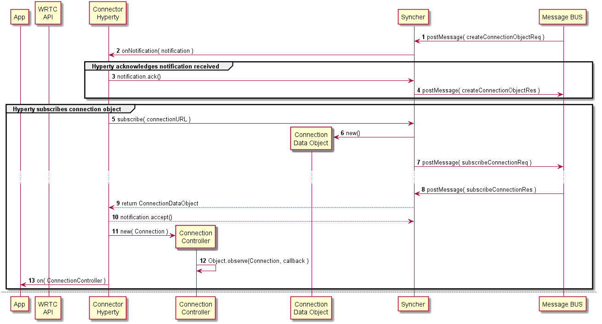

Dummy Header for Section per ToC
================================

Hyperties Specification
=======================

Connector Hyperty
-----------------

### Architecture

*Describe main Hyperty functionalities, Hyperty type and scenarios where the Hyperty will be used. Describe main internal Hyperty component architecture with a class diagram.*

The Connector main functionality is to handle two party audio and voice conversations. *the support of Multiparty calls is for further study*

*the next paragraphs to be moved to smart voice Hyperty*

Thus, a few actions are automatically performed according to user context (*the relationship of this automation with Hyperty Policies is for further study*). Contextual behavior is configurable by the App.

#### Contextual Behavior Examples

Presence Context

**Busy** automatically reject or forward incoming invitation to another user or Media Hyperty if inviter is not part of my favourites group.

Activity Context

**Running**

Location Context

### Hyperty Data Objects schemas

*Identify reTHINK standardised data object schemas or Specify new Data Object schemas handled by the Hyperty*

This Hyperty handles a standard [Connection Data Object](https://github.com/reTHINK-project/architecture/tree/master/docs/datamodel/context).

### Hyperty API

*Specify Hyperty API to be consumed by the Application*

### Main data flows

*Use MSCs to describe how the Application can use the Hyperty API for the main use cases supported by the Hyperty. Mapping between the Hyperty API functions and the Hyperty Framework functions including the Data Object handling should be depicted in separated in Diagrams*

Discovery of User (Bob) to connect to:

Notify Bob about Connection Request:

Bob receives Connection Request notification:

Bob accepts Connection Request:

Alice is aknowledge that Bob accepts Connection Request:

