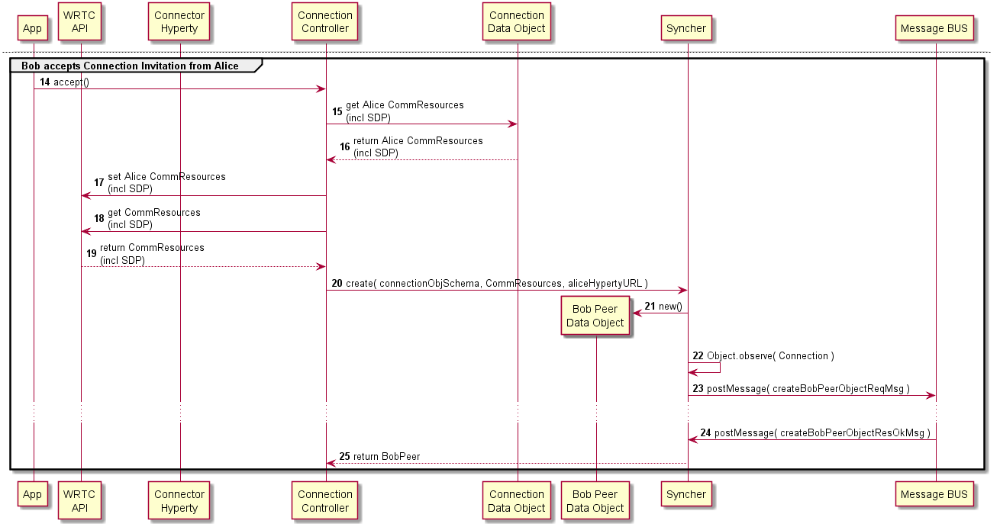

Dummy Header for Section per ToC
================================

Hyperties Specification
=======================

Connector Hyperty
-----------------

### Architecture

*Describe main Hyperty functionalities, Hyperty type and scenarios where the Hyperty will be used. Describe main internal Hyperty component architecture with a class diagram.*

The Connector main functionality is to handle two party audio and voice conversations. *the support of Multiparty calls is for further study*

As depicted above, the Connector Hyperty comprises the Connector class that handles the creation of new outgoing or incoming connections. Each Connection instance is controlled by the ConnectionController class that uses the the native WebRTC API.

The Connection signalling is handled by the Syncher class from the Hyperty Service Framework library according to the Reporter-Observer data synchronisation mechanism, by using the standard [Connection Data Objects](https://github.com/reTHINK-project/architecture/tree/master/docs/datamodel/connection).

### Hyperty Data Objects schemas

*Identify reTHINK standardised data object schemas or Specify new Data Object schemas handled by the Hyperty*

This Hyperty handles standard [Connection Data Objects](https://github.com/reTHINK-project/architecture/tree/master/docs/datamodel/connection).

### Hyperty API

*Specify Hyperty API to be consumed by the Application*

The Connector Hyperty implements two Hyperty APIs:

#### Hyperty Connector API

The Hyperty Connector API is used to create new connections.

**addListener**

This function is used to handle notifications about incoming requests to create a new connection.

**connect**

This function is used to create a new connection providing the identifier of users to be notified.

#### Hyperty ConnectionController API

The Hyperty ConnectionController API is used to control a connection instance.

**disconnect**

This function is used to close an existing connection instance.

**addPeer**

This function is used to add / invite new peers on an existing connection instance (for multiparty connections).

**removePeer**

This function is used to remove a peer from an existing connection instance.

### Main data flows

*Use MSCs to describe how the Application can use the Hyperty API for the main use cases supported by the Hyperty. Mapping between the Hyperty API functions and the Hyperty Framework functions including the Data Object handling should be depicted in separated in Diagrams*

The following main use cases are supported by the Connector Hyperty:

#### Hyperty initialisation

Application adds a listener to receive incoming connection requests events.

#### Create new Connection

Notify Bob about new incoming Connection Request:

#### Notification about incoming connection request

Bob receives Connection Request notification:

#### Accept incoming connection request

Bob accepts Connection Request:

#### Aknowledgment that requested Connection was accepted by remote peer

Alice is aknowledge that Bob accepts Connection Request:

#### ICE candidates exchanged

*to be provided*

#### Connection is established

*to be provided*

#### Connection is closed by local peer

Connection is disconnected:

#### Connection is closed by remote peer

*to be provided*
