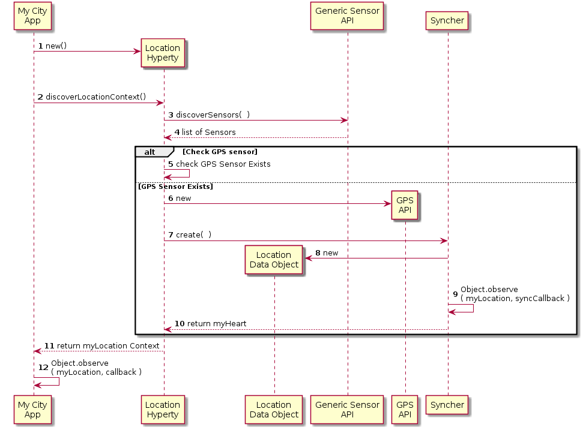

Dummy Header for Section per ToC
================================

Hyperties Specification
=======================

Location
-------------------

### Architecture

*Describe main Hyperty functionalities, Hyperty type and scenarios where the Hyperty will be used. Describe main internal Hyperty component architecture with a class diagram.*

The Location Hyperty main functionality is to collect geolocation data from a device, publish it to a certain Context Resource URL allocated by the Hyperty Runtime and notifying the App about context changes.

### Hyperty Data Objects schemas

*Identify reTHINK standardised data object schemas or Specify new Data Object schemas handled by the Hyperty*

This Hyperty handles a standard [Context Data Object](https://github.com/reTHINK-project/architecture/tree/master/docs/datamodel/context) with:

**ContextType**

Geolocation


**ContextUnit**

-	coordinates: GPS coordinate (latitude,longitude) in decimal degrees
-	altitude: altitude given by the GPS chip

### Hyperty API

*Specify Hyperty API to be consumed by the Application*

Location API is aligned with [W3C Generic Sensor API](http://www.w3.org/TR/2015/WD-generic-sensor-20151015/)

**Discover Available Health Context from the Bracelet**

```
Promise<ContextDataObjectList> discoverGeolocationContext( )
```

**Start Data Reading from Sensors**

options parameter is of type SensorOptions defined in [W3C Generic Sensor API](http://www.w3.org/TR/2015/WD-generic-sensor-20151015/#the-sensor-interface)

```
startReading( SensorOptions options )
```

### Main data flows

*Use MSCs to describe how the Application can use the Hyperty API for the main use cases supported by the Hyperty. Mapping between the Hyperty API functions and the Hyperty Framework functions including the Data Object handling should be depicted in separated in Diagrams*

Location Setup:




