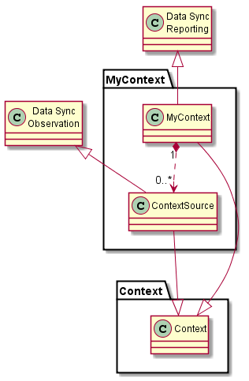
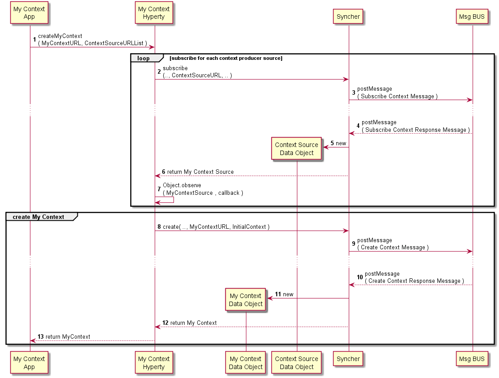
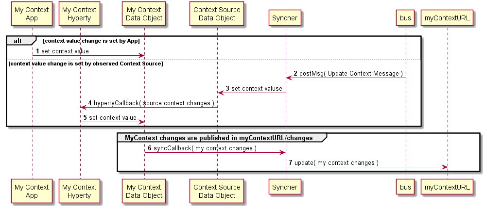

Dummy Header for Section per ToC
================================

Hyperties Specification
=======================

My Context Hyperty
------------------

### Architecture

*Describe main Hyperty functionalities, Hyperty type and scenarios where the Hyperty will be used. Describe main internal Hyperty component architecture with a class diagram.*

The My Context Hyperty main functionality is to collect context data from other Hyperties or from the App and publish it to a certain Context Resource URL provided by the App.

### Hyperty Data Objects schemas

*Identify reTHINK standardised data object schemas or Specify new Data Object schemas handled by the Hyperty*



This Hyperty handles a list of observed standard [Context Data Object](https://github.com/reTHINK-project/architecture/tree/master/docs/datamodel/context), which are aggregated and reported in another standard Context Data Object.

### Hyperty API

*Specify Hyperty API to be consumed by the Application*

**createMyContext**

```
Promise<ContextDataObject> createMyContext( URL.ContextURL myContextURL, URL.ContextURLList sources )
```

### Main data flows

*Use MSCs to describe how the Application can use the Hyperty API for the main use cases supported by the Hyperty. Mapping between the Hyperty API functions and the Hyperty Framework functions including the Data Object handling should be depicted in separated in Diagrams*

My Context Setup:



Publish My Context Updates:


