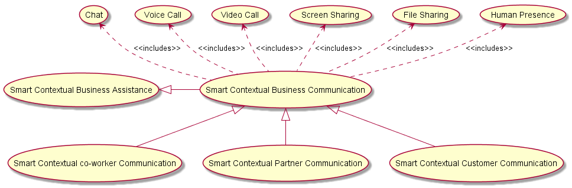
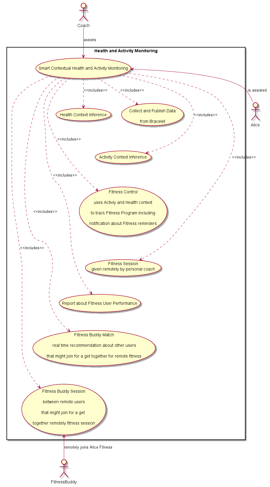

*in progress*

Smart Contextual Assistance
---------------------------

Scenario Environment
--------------------

-	PT is a Business Broker managing an ecosystem of different partners including HySmart which is an expert on IoT Hyperties
-	PT delivers Smart Business Assistance App in a partnership with HySmart
-	PT also delivers communication (ie plays the CSP role) and Identity Hyperties (ie plays the IdP role)
-	PT provides a Global Registry
-	Alice is an individual end-user (service consumer) that works for Old Inn hotel (organization consumer), which provided her a Smart Work Assistance App to support her in the Job.
-	Alice is free to use an Identity provided by PT or by others trustful IdPs like the iHackker IdP
-	Smart Business Assistance enables Alice to collaborate with co-workers, external partners using other similar applications, as well as with customers.
-	Smart Business Assistance enables Alice to control some office devices including ...
-	Alice has subscribed additional Smart Contextual Assistance features, with a special discount, to be used in a personal context ie acting as a Smart Personal Assistance App, enabling Alice to manage personal communications and to control her smart home devices.

Alice uses a bracelet to track her health status.

At Old Inn hotel, the following devices are available:

-	1 Web Cameras eg [Raspberry PI Camera Module](https://www.raspberrypi.org/products/camera-module/)
-	[Power Control ](https://energenie4u.co.uk/catalogue/category/Raspberry-Pi-Accessories)

At Alice's home, the following devices are available:

-	1 Web Cameras eg [Raspberry PI Camera Module](https://www.raspberrypi.org/products/camera-module/)
-	[Power Control ](https://energenie4u.co.uk/catalogue/category/Raspberry-Pi-Accessories)

User perspective
----------------

*Textual description of the scenario including the main use cases to be supported. Refer as much as possible to use cases defined in D1.1.*

The Smart Contextual Assistance Apps automatically adapts its behavior according to Alice's context and a Physical Space's (office room or home room) context. Two main Alice's context's are considered: Work context and Personal context.

### Work Context

Alice context is mainly derived from the following Context sources:

-	location
-	calendar
-	communication parties
-	opened web documents
-	sensors in Alice's mobile
-	sensors in physical places where Alice is located

#### Office Automation

When Alice context is "located in the Office" a few office automation features (see picture below) her available from the Smart Business Assistance app.

The following WP1 Use Cases are required:

-	[Registering Devices](https://github.com/reTHINK-project/use-cases/issues/66)
-	[M2M Always Connected in Trustful Domains for Multi-vendor devices](https://github.com/reTHINK-project/use-cases/issues/5)
-	[Information reception from a sensor](https://github.com/reTHINK-project/use-cases/issues/70)
-	Device Control (*no use case defined in WP1*\)

#### Business Communication

Alice context can also be set according to the communication party (see figure below), namely:

-	Customer Context: Alice is in a communication session with a Customer
-	co-worker Context: Alice is in a communication session with a co-worker
-	Partner Context: Alice is in a communication session with a Partner

The following WP1 Use Cases are required:

-	[H2H Conversation with single CSP](https://github.com/reTHINK-project/use-cases/issues/1)
-	[Messaging / Chat](https://github.com/reTHINK-project/use-cases/issues/35)
-	[H2H inter-domain Conversation with different CSPs and external IdPs](https://github.com/reTHINK-project/use-cases/issues/95)
-	[H2H Multiparty Conversations](https://github.com/reTHINK-project/use-cases/issues/86)
-	[Human presence](https://github.com/reTHINK-project/use-cases/issues/47)

Alice calendar and opened Web Documents is another source of information to be taken into account to infer Alice Context.

*to be done: provide use cases diagram for work context inference*

According to the context status, the communication experience is adapted in order to make it as effective as possible, e.g. Alice Identity selection and associated user profile data, availability of communication features like video, etc.

**Customer Context**

The picture below depicts the different Customer Communication Use Cases.

The following WP1 Use Cases are required:

-	[Context-Aware Contact Center](https://github.com/reTHINK-project/use-cases/issues/94)
-	[Business Identity in H2H Communication](https://github.com/reTHINK-project/use-cases/issues/93)

**co-worker context**

*to be done*

**partner context**

*to be done*

### Personal Context

#### Home Automation

When Alice context is "located in her home" a few Home automation features (see picture below) her available from the Smart Personal Assistance app.

#### Activity and Health Monitoring

Alice health is continuously monitored through her bracelet and she follows a strict workout program to keep her in a good shape. Alice workout includes sessions in her gymnasium and outside her gymnasium (e.g. biking and running). Alice activity is continuously monitored by the App who also reminds her about workout activities to be performed. Alice's personal coach can remotely track Alice's performance, giving advice and setting up remote multimedia sessions to coach her (in a group or individually, according to subscribed workout program).

Workout Assistance App also enables her to meet and join other people following similar Workout programs. For example, during fitness sessions the App can also recommend to setup remote sessions at the same time and do fitness together as if they were in the same location. During these Do Remote Fitness Together Session, users can share in real time workout performance indicators in order to motivate each other.

Alice activity and health monitoring produce Alice Health Context and Alice Activity status inferred according to some AI algorithms.

#### Personal Communication

Alice's communication experience is adapted according to Alice's context, namely:

-	when training, only a small group of people can reach Alice including people from Alice's personal contact list and work contact list.
-	when training (or on the go), the focus is on voice user interface to handle communication (including ongoing communications).

Alice context can also be set according to the communication party including friends and relatives.

### Identity Management and Trust from user perspective

*Textual description of Identity Management and Trust aspects from User Perspective*

As mentioned below, Alice identity selection will depend on her context. For example, Enterprise Identity will be used for anonymous customers while a personal (pseudonym ?) Identity will be used for loyal Customers. Trust will also be set according to selected identities.

### Interoperability from user perspective

*Textual description of interoperability involving the usage of Apps delivered from different Testbed e.g. Audio Call between a Conversation App from DT and a Conversation App from PT*

Customers and Partners can use any application from other testbeds to communicate with Smart Contextual Assistance App. *to be identified the ones to interoperate with, later*

Smart Contextual Assistance App office and home automation features should be able to be used in the Hotel Guest scenario when appropriately authorized by the Hotel management. The other way around should also be possible.

Required reTHINK Framework Functionalities
------------------------------------------

*Detailed analysis of required functionalities, interfaces and data schemas as specified in D2.2, D3.1 and D4.1. Highlight missing functionalities*

The Smart Contextual Assistance requires the following major reTHINK functionalities:

-	Hyperty Runtime in Browser
-	Hyperty Runtime in Smartphone
-	Hyperty Runtime in Raspberry PI
-	Hyperty Runtime in Kurento Media Server to support Group Communication
-	Vertx Message Node and its associated Protostub
-	*partner1* Message Node and its associated Protostub to test cross domain H2H Communication interoperability
-	*partner2* Message Node and its associated Protostub to test cross domain M2M Communication interoperability
-	*partner3* Message Node and its associated Protostub to test cross domain H2M Communication interoperability
-	Catalogue server as specified in D2.2 supporting protostub descriptors, Hyperty descriptors, Data Object Schema.
-	Domain Registry as specified in D2.2 supporting Hyperty Instance registration, Hyperty Data Object Instance registration
-	At least two different IdP servers and its associated IdP (Proxy) protostub
-	Discovery service (to be confirmed)

The following APIs and Procedures are required and not yet specified:

WP4

-	Account registration
-	Identity login
-	Authorisation
-	Identity association to Hyperty
-	Identity assertion
-	Human Discovery
-	Machine / Object Discovery
-	Trust calculation / evaluation

WP3

-	Chat and Group Chat
-	Human Presence
-	File Sharing
-	Screen Sharing
-	Device Control / Actuation

*to be completed*

Required Testbed features
-------------------------

The following domains should be provided:

-	broker.rethink.ptinovacao.pt
-	hysmart.rethink.ptinovacao.pt
-	iHackker.rethink.ptinovacao.pt

PT Broker should provide the following servers (and associated sub-domains):

-	Vertx Messaging Node (node.broker.rethink.ptinovacao.pt)
-	Domain Registry (registry.broker.rethink.ptinovacao.pt)
-	Catalogue server (catalogue.broker.rethink.ptinovacao.pt)
-	IdM Server (?) (idm.broker.rethink.ptinovacao.pt)
-	Global Registry
-	TURN/STUN server

HySmart should provide the following servers (and associated sub-domains):

-	Domain Registry (registry.hysmart.rethink.ptinovacao.pt)
-	Catalogue server (catalogue.hysmart.rethink.ptinovacao.pt)

*Identify features required from Testbed operators including Public IPs, number of Docker images/Servers and its characteristics, ports to be opened, .. Use a Network diagram.*

Required Hyperties
------------------

*identify required Hyperties, its main functionalities and associated data schemas. Use a graphical language to describe hyperties composition and relationships (to be defined)*

