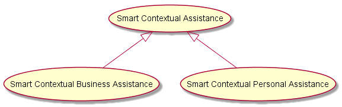

*in progress*

Smart Contextual Assistance
---------------------------

Scenario Environment
--------------------

-	Alice is an individual end-user (service consumer) that works for Old Inn hotel (organisation consumer), which provided her a Smart Work Assistance App to support her in the Job.
-	Smart Business Assistance App is delivered by HyDev which is a small Software Development composed by several Hyperties delivered by PT and others.
-	Smart Business Assistance enables Alice to collaborate with co-workers, external partners using other similar applications, as well as with customers.
-	Smart Business Assistance enables Alice to control some office devices including ...
-	Alice has subscribed additional Smart Contextual Assistance features, with a special discount, to be used in a personal context ie acting as a Smart Personal Assistance App, enabling Alice to manage personal communications and to control her smart home devices.
-	PT is a Business Broker managing an ecosystem of different partners including HyDev and Device Hyperty providers -

Devices (*still under research*\)

-	2 Web Cameras eg [Raspberry PI Camera Module](https://www.raspberrypi.org/products/camera-module/)
-	[Power Control ](https://energenie4u.co.uk/catalogue/category/Raspberry-Pi-Accessories)
-	Heart Rate Sensor eg [pulse sensor amped](http://www.adafruit.com/products/1093) or [wireless](http://www.adafruit.com/products/1077)

User perspective
----------------

*Textual description of the scenario including the main use cases to be supported. Refer as much as possible to use cases defined in D1.1.*

### Work Context

Alice context is mainly derived from two of Context sources: location and communication parties.

#### Office Automation

When Alice context is "located in the Office" a few office automation features (see picture below) her available from the Smart Business Assistance app.

#### Business Communication

Alice context can also be set according to the communication party (see figure below), namely:

-	Customer Context: Alice is in a communication session with a Customer
-	co-worker Context: Alice is in a communication session with a co-worker
-	Partner Context: Alice is in a communication session with a Partner

Alice calendar and opened Web Documents is another source of information to be taken into account to infer Alice Context.

*to be done: provide use cases diagram for work context inference*

According to the context status, the communication experience is adapted in order to make it as effective as possible, e.g. Alice Identity selection and associated user profile data, availability of communication features like video, etc.

**Customer Context**

The picture below depicts the different Customer Communication Use Cases.

**co-worker context**

**partner context**

### Personal Context

### Identity Management and Trust from user perspective

*Textual description of Identity Management and Trust aspects from User Perspective*

### Interoperability from user perspective

*Textual description of interoperability involving the usage of Apps delivered from different Testbed e.g. Audio Call between a Conversation App from DT and a Conversation App from PT*

Required reTHINK Framework Functionalities
------------------------------------------

*Detailed analysis of required funcionalities, interfaces and data schemas as specified in D2.2, D3.1 and D4.1. Highlight missing functionalities*

Required Testbed features
-------------------------

*Identify features required from Testbed operators including Public IPs, number of Docker images/Servers and its characteristics, ports to be opened, .. Use a Network diagram.*

Required Hyperties
------------------

*identify required Hyperties, its main functionalities and associated data schemas. Use a graphical language to describe hyperties composition and relationships (to be defined)*

**references**

[Open HOME AUTOMATION](https://www.openhomeautomation.net)
