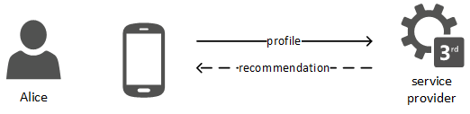
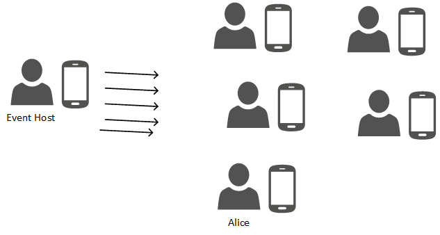
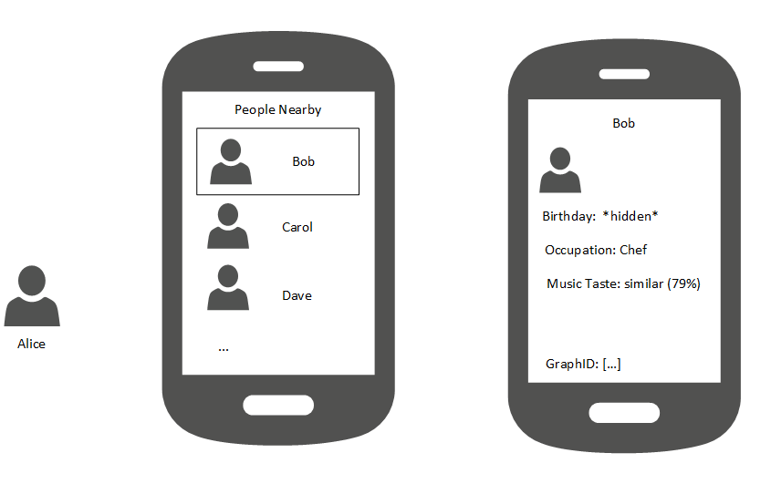
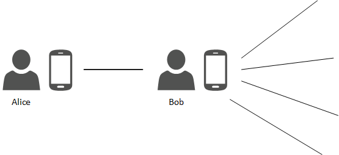

Dummy Header for Section 1 per ToC
==================================

Usage Scenarios Description
===========================

Tourism a Smart City
----------------------------------

###Scenario Environment (User Scenario #3)

Frank arrived in Bersabon on Friday morning. In the terminal building of the airport he sees an advertisement of the city app “Participate” and a QR code next to it. He downloads the app and reads through the welcome page and enters a Nickname. In the next step he is asked some questions about himself, utilizing some information from a social network about his preferences and manually the Hotel name he is staying in to enhance his stay. Perfect! The hotel his envisaged on a map and he can ask for the best route. The application provides him with the quickest public transportation route and best ticket options. Sitting in the underground he looks through some recommendations provided via the application, based on his preferences. He reads about a pub crawl tonight. After he read some comments from other participants he decides to participate since he has no appointment for tonight. After the Hotel check in, he starts his sightseeing tour. He searches for the location of the film museum and receives additionally the information, that there is long waiting queue currently. A blinking button saying “Guided Tour in Esperanto” catches his eyeball. He presses the button and a smile runs over his face. Since he has provided his mother tongue during the welcome process he is informed that already 7 other group members from his country have joined the group. The information on the page tells him, that in case more than 7 people request for a conducted tour in Esperanto there will be a tour in 3 hours. He quickly checks in for the group and is informed that for reservation and payment purposes he needs to provide his name and the hotel where he stays for verification purposes. Once the hotel content management system approves his name, the reservation is confirmed. At the museum he quickly finds his group on the map. The tour is perfect and he tells his new party about the pub crawl and gets some other ideas for the next day from them.

###User perspective

Going through her daily life, Alice is collecting data on her smartphone, e.g. by  locally storing locations she frequently visits, from sensors she retrieves information from or including news websites which inform her about the latest movies with her favorite actor. The process of acquiring data from sensors and webservices is visualized in the following figure.

 
Alice moves to a new city and queries her service provider for a recommendation on what to do in the new city, see the next figure. Based on her profile data, she is recommended a social event that takes place in the evening. (Associated use case: #72 Recommendation by service provider based on context and preference)

 
At the event, the smartphones of the attending users are used to transmit some of their profile information to a server or service that is connected to a large display at the event. On this display, the profile pictures of the attending guests are shown (see following figure). (Associated use case: #80 Ad-hoc community)
 

 
The event host is broadcasting announcements to the attending event guests, for example information about the buffet or vouchers for drinks at the bar at bigger events. (Associated use case: #14 Ad-hoc group massaging)

 
On her smartphone, Alice looks through the list of attendees. Bob strikes her interest: Alice is interested to meet someone who knows the city’s restaurant scene. In Bob’s profile, Alice can see that he is a chef. Additionally, the music taste is indicated as similar to that of Alice. Bob decided to share his birthday only with his friends, so Alice cannot see it yet. Alice to go find Bob at the party. (Associated use case: #15 Retrieving public information from nearby people)

 
Alice starts a conversation with Bob. After becoming friends, Alice can see his whole profile. They talk about the music they like and the restaurant scene in the city. Bob knows the restaurants in the city and can recommend one to Alice. For other things like sports, Alice and Bob are not that similar, but Alice can query Bob in order to use his connections to other people to retrieve further recommendations. (Associated use case: #71 Recommendation by friend)

#### Identity Management and Trust from user perspective

*Textual description of Identity Management and Trust aspects from User Perspective*

#### Interoperability from user perspective

*Textual description of interoperability involving the usage of Apps delivered from different Testbed e.g. Audio Call between a Conversation App from DT and a Conversation App from PT*

###Required reTHINK Framework Functionalities

*Detailed analysis of required funcionalities, interfaces and data schemas as specified in D2.2, D3.1 and D4.1. Highlight missing functionalities*

###Required Testbed features

*Identify features required from Testbed operators including Public IPs, number of Docker images/Servers and its characteristics, ports to be opened, .. Use a Network diagram.*

Note that so far only one test bed operator has specified available components [see issues](https://github.com/reTHINK-project/testbeds/issues?utf8=✓&q=is%3Aissue+Constraints+of+Test+Bed+Operators+).  If you sepcify any requirements in access of the specified available components, you might face the situation that the use case might not be run on a available testbed.

###Required Hyperties

*identify required Hyperties, its main functionalities and associated data schemas. Use a graphical language to describe hyperties composition and relationships (to be defined)*

