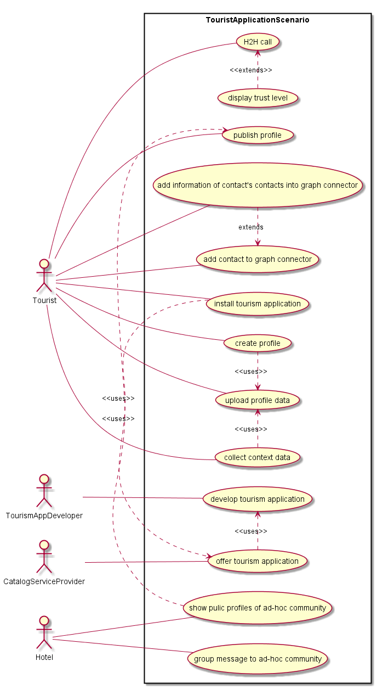

Dummy Header for Section 1 per ToC
==================================

Usage Scenarios Description
===========================

Tourism in a Smart City
----------------------------------

###Scenario Environment (User Scenario #3)

The Smart Tourist Application User Scenario is situated wihtin a smart economy environment in a smart city, named Bersabon. Deliverable D1.1 describes the scenario as follows:

> Frank arrived in Bersabon on Friday morning. In the terminal building of the airport he sees an advertisement of the city app “Participate” and a QR code next to it. He downloads the app and reads through the welcome page and enters a Nickname. In the next step he is asked some questions about himself, utilizing some information from a social network about his preferences and manually the Hotel name he is staying in to enhance his stay. Perfect! The hotel his envisaged on a map and he can ask for the best route. The application provides him with the quickest public transportation route and best ticket options. Sitting in the underground he looks through some recommendations provided via the application, based on his preferences. He reads about a pub crawl tonight. After he read some comments from other participants he decides to participate since he has no appointment for tonight. After the Hotel check in, he starts his sightseeing tour. He searches for the location of the film museum and receives additionally the information, that there is long waiting queue currently. A blinking button saying “Guided Tour in Esperanto” catches his eyeball. He presses the button and a smile runs over his face. Since he has provided his mother tongue during the welcome process he is informed that already 7 other group members from his country have joined the group. The information on the page tells him, that in case more than 7 people request for a conducted tour in Esperanto there will be a tour in 3 hours. He quickly checks in for the group and is informed that for reservation and payment purposes he needs to provide his name and the hotel where he stays for verification purposes. Once the hotel content management system approves his name, the reservation is confirmed. At the museum he quickly finds his group on the map. The tour is perfect and he tells his new party about the pub crawl and gets some other ideas for the next day from them.

In this ecosystem, Alice is a tourist who visits the city of Bersabon. She is staying in the Old Inn Smart Hotel. Upon her arrival at the Airport, she downloaded the participate application to her Smartphone and registered as a user. Among information and recommendation functionality, the app also offers social networking functionality to connect to other tourists using the same application.

Going through her daily life, Alice is collecting data on her smartphone, e.g. by locally storing locations she visits or music that she listens to. The process of acquiring data from sensors and webservices is visualized in the following figure.

Arriving at her hotel, Alice notices a screen that display short profiles about other tourists that already entered the hotel. A user named Bob catches her eye as he has the same taste in music. Alice decides to take part in the screen, scans a QR code and submits her public profile. She decides to get in contact with Bob and ask him to discover the city together.

First, checking into her room, Alice and the other tourists in the hotel receive a notifcation. The hotel offers a pub crawl at night. Alice sees that Bob is participating and decides to join.

At night, Alice and Bob meet in the lobby and exchange their contact data.

They talk about their common interest music. During her vacation, Alice is also interested in playing tennis. Unfortunately, in this regard, Alice and Bob are not a good match, as Bob is not very sporty. After the pub crawl, Alice and Bob don't see each other again, but Bob gives Alice's GUID to his friend Charlie, who is interested in sports. The next day, Alice receives a call from an unknown caller. On her display, it is indicated that she has one mutual friend with the caller. She picks up and on the phone is Charlie, a friend of Bob's who is interested in playing tennis with her!

In order to summarize the contained use cases in this scneario, we give the following use case UML diagramm:

###User perspective
 

#### Identity Management and Trust from user perspective

*Textual description of Identity Management and Trust aspects from User Perspective*

* Identity in this context suffices to be provided by the GUIDs.
* Trust is indicated by the number of mutual friends when Alice receives the call from Charlie.

#### Interoperability from user perspective

*Textual description of interoperability involving the usage of Apps delivered from different Testbed e.g. Audio Call between a Conversation App from DT and a Conversation App from PT*

to be done

###Required reTHINK Framework Functionalities

*Detailed analysis of required funcionalities, interfaces and data schemas as specified in D2.2, D3.1 and D4.1. Highlight missing functionalities*

* Hyperty Runtime in Smartphone
* GUIDs (for users to be identified)
* some Messaging Node for establishing H2H call
* Catalog for downloading hyperties
* Global Registry (for Charlie finding Alice's domain registries)
* Domain Registry (for Charlie finding Alice's live hyperties)
* Graph Connector (for trust indication when Charlie calls Bob)
* group message

###Required Testbed features

*Identify features required from Testbed operators including Public IPs, number of Docker images/Servers and its characteristics, ports to be opened, .. Use a Network diagram.*

* some messaging node
* Domain Registry
* Global Registry
* Catalog

###Required Hyperties

*identify required Hyperties, its main functionalities and associated data schemas. Use a graphical language to describe hyperties composition and relationships (to be defined)*

* generating profile
* uploading profile to some host

to be completed

TOOD: graphical representation
